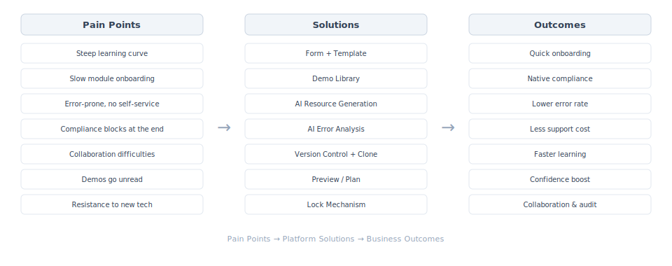

# Terranova

> A self-hosted Infrastructure-as-Code platform — Schema-driven, AI-assisted, compliance-by-design.

<p align="center">
  <a href="README.md">English</a> | <a href="README_CN.md">中文</a>
</p>

<p align="center">
  <a href="#quick-start">Quick Start</a> ·
  <a href="#what-problem-does-it-solve">Problem</a> ·
  <a href="#how-it-works">How it Works</a> ·
  <a href="#features">Features</a> ·
  <a href="#docs">Docs</a>
</p>

---

## What Problem Does It Solve

<p align="center">
  
</p>

Traditional IaC treats code as the single source of truth. Compliance happens at the end (Sentinel/OPA blocking after submission). Standards live in wikis and human memory. Junior engineers operate with high risk. Governance always lags behind execution.

**This platform redesigns IaC around three observations:**

1. **Code is not truth** — State is the source of truth. Code is an intent proposal constrained by Schema and validated against State.
2. **Compliance should not be an afterthought** — Instead of "check if compliant", the system ensures "can only generate compliant resources".
3. **Terraform is an execution engine, not a platform** — Execution is replaceable. Standards, governance, and knowledge evolve independently.

### Core: Schema-Driven Native Compliance

One Schema simultaneously drives three things:

| Target | Role | What it does |
|--------|------|-------------|
| **Frontend Form** | For humans | Constrains input boundaries, renders smart forms |
| **Module Skill** | For AI | Tells AI how to correctly use the module |
| **Schema Resolver** | For the system | Final arbiter of AI-generated output |

Result: compliance is built into the generation process. Users rarely see compliance errors.

### Collaboration Model

| Role | Responsibility |
|------|---------------|
| **Module Contributors** | Design Modules, define Schema & constraints, codify best practices |
| **Policy Engineers** | Contribute best-practice Skills, define compliance policies, embed OPA/custom checks into Run Tasks — from "you can't do this" to "you can do this" |
| **Delivery Engineers** | Operate resources through Forms within safe boundaries |
| **Platform Maintainers** | Provide platform capabilities, foundation AI Skills |

Knowledge flows upward: delivery engineers can submit Modules that, after review, become organizational standards.

---

## Quick Start

```bash
cp docker-compose.example.yml docker-compose.yml
docker compose up -d
# Visit http://localhost
```

For production: see [Kubernetes deployment](manifests/README.md).

---

## How it Works

<p align="center">
  
</p>

**Layered truth model:**

| Layer | Meaning |
|-------|---------|
| **State** | What the real world looks like now |
| **Schema** | What states are allowed and recommended |
| **Code** | How you want state to change |

**Four-layer architecture:**

| Layer | Capabilities |
|-------|-------------|
| **Interaction** | UI-first management, global search, Form/Code dual-mode editing, Manifest drag-and-drop |
| **Control & Governance** | IAM/RBAC, SSO/MFA, Run Tasks (4-phase hooks), Drift detection, audit logs |
| **Execution** | Terraform/OpenTofu dual-engine, multi-version, Agent isolation, K8s auto-scaling |
| **Knowledge & Ecosystem** | Schema-driven Skill generation, vectorized CMDB, AI with constrained execution |

**AI resource generation flow:**

```
User request
  → Schema renders form (constrain input)
  → Skill auto-assembly: Foundation + Best Practice + Module Skill
  → Vectorized CMDB context enrichment
  → LLM generates resource parameters
  → Schema Resolver validates + repair loop
  → Compliant resource definition
```

---

## Features

<details>
<summary><b>Schema & AI</b></summary>

- Schema-driven form generation (OpenAPI V3)
- Module Skill auto-generation from Schema
- Three-tier Skill assembly: Foundation (mandatory) → Best Practice → Module
- Vectorized CMDB: natural language resource search, context completion
- AI security assertion before every LLM call
- AI inherits user permissions
- Schema Resolver: final validation with auto-repair loop

</details>

<details>
<summary><b>Module Management</b></summary>

- Versioned Schema and Demo per module version
- Parameter grouping and conditional rules (mutual exclusion, dependencies)
- Value sources: CMDB / Workspace Output / Remote Workspace
- OpenAPI V3 visual editor
- AI-assisted code and form generation

</details>

<details>
<summary><b>Workspace</b></summary>

- Form/JSON dual-mode resource editing with version control and rollback
- Resource lock + draft mechanism for concurrent editing
- State card view with explicit Retrieve + IAM permission
- Variable versioning with per-run snapshots, sensitive variable encryption
- Drift detection (manual/auto/silent)
- Run details with structured change view, phased logs, AI error analysis
- Output linking with whitelist control
- Run Triggers from upstream Workspaces

</details>

<details>
<summary><b>Control & Governance</b></summary>

- RBAC: built-in roles + custom roles + user groups
- Personal tokens (session-bound) / Team tokens (persistent)
- SSO integration (Auth0, Google, GitHub, Azure AD, Okta)
- MFA two-factor authentication
- Run Tasks: Pre/Post Plan/Apply hooks, mandatory/advisory modes
- Full audit logging

</details>

<details>
<summary><b>Agent & Execution</b></summary>

- Terraform / OpenTofu dual-engine with multi-version support
- Agent-based isolated execution within secure network zones
- Network allowlist + credential rotation
- K8s auto-scaling, inactive zone shutdown with emergency thaw
- Custom agent deployment templates

</details>

<details>
<summary><b>Manifests</b></summary>

- Drag-and-drop module orchestration with dependency visualization
- Inherits all Workspace Form/JSON/AI capabilities
- Multi-deployment with history tracking

</details>

---

## Tech Stack

| | Technology |
|---|-----------|
| **Frontend** | React 18, TypeScript, Ant Design, Vite |
| **Backend** | Go, Gin, GORM |
| **Database** | PostgreSQL 18+ (pgvector) |
| **AI** | AWS Bedrock / OpenAI-compatible |
| **IaC Engine** | Terraform / OpenTofu |
| **Deploy** | Docker Compose / Kubernetes |

---

## Development

**Requirements:** Go 1.25+, Node.js 22+, PostgreSQL 18+ (pgvector), Docker

---

## Docs

| Topic | Path |
|-------|------|
| Workspace | `docs/workspace/` |
| IAM | `docs/iam/` |
| Module | `docs/module/` |
| Agent | `docs/agent/` |
| CMDB | `docs/cmdb/` |
| AI | `docs/ai/` |
| Run Tasks | `docs/run-task/` |
| Schema | `docs/schema/` |
| Security | `docs/security/` |

---

## License

MIT — see [LICENSE](LICENSE)
