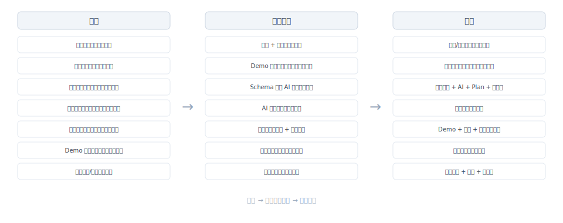
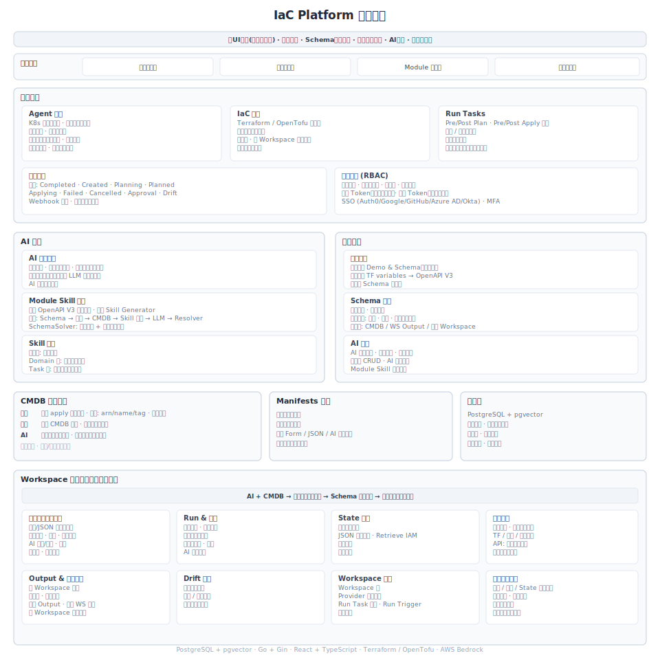

# IaC Platform

<p align="center">
  <a href="README.md">English</a> | <a href="README_CN.md">中文</a>
</p>

<p align="center">
  <a href="#快速部署">快速部署</a> ·
  <a href="#解决什么问题">解决什么问题</a> ·
  <a href="#工作原理">工作原理</a> ·
  <a href="#功能特性">功能特性</a> ·
  <a href="#文档">文档</a>
</p>

---

## 解决什么问题

<p align="center">
  
</p>

传统 IaC 将代码视为唯一事实源。合规发生在最后阶段（Sentinel / OPA 事后拦截）。规范存在于 Wiki 和人的记忆中。初级工程师操作风险高。治理始终滞后于执行。

**本平台基于三个判断重新设计 IaC：**

1. **代码不是真理** — State 是唯一事实源。代码是在 Schema 约束下、以 State 为校验基础的状态迁移提案。
2. **合规不应是事后补救** — 从"检查是否合规"转变为"只能生成合规资源"。
3. **Terraform 是执行引擎，不是平台** — 执行可替换，规范、治理、知识独立演进。

### 核心：Schema 驱动的天生合规

同一份 Schema 同时驱动三件事：

| 目标 | 角色 | 作用 |
|------|------|------|
| **前端表单** | 面向人 | 约束输入边界，渲染智能表单 |
| **Module Skill** | 面向 AI | 告知 AI 如何正确使用 Module |
| **Schema Resolver** | 面向系统 | AI 输出的最终事实裁判 |

结果：合规内建于生成过程，用户几乎看不到合规报错。

### 协作模型

| 角色 | 职责 |
|------|------|
| **Module 贡献者** | 设计 Module、定义 Schema 与约束、固化最佳实践 |
| **策略工程师** | 提交最佳实践 Skill、定义合规策略、通过 Run Tasks 嵌入 OPA 等中段校验 — 从「不可以这么做」转为「可以这么做」 |
| **交付工程师** | 通过 Form 在安全边界内操作资源 |
| **平台维护者** | 提供平台基础能力、基础 AI Skill |

知识向上沉淀：交付工程师可提交 Module，经评审后成为组织标准。

---

## 快速部署

```bash
cp docker-compose.example.yml docker-compose.yml
docker compose up -d
# 访问 http://localhost
```

生产环境部署：参见 [Kubernetes 部署文档](manifests/README.md)。

---

## 工作原理

<p align="center">
  
</p>

**分层事实模型：**

| 层级 | 含义 |
|------|------|
| **State** | 现在真实世界是什么样子 |
| **Schema** | 什么样的状态是被允许和推荐的 |
| **Code** | 希望状态如何发生变化 |

**四层架构：**

| 层 | 能力 |
|---|------|
| **交互层** | UI 优先、全局搜索、Form/Code 双模态、Manifest 拖拽编排 |
| **控制与治理层** | IAM/RBAC、SSO/MFA、Run Tasks（四阶段 Hook）、Drift 检测、审计日志 |
| **执行层** | Terraform/OpenTofu 双引擎、多版本、Agent 隔离执行、K8s 弹性伸缩 |
| **知识与生态层** | Schema 驱动 Skill 生成、向量化 CMDB、AI 受约束执行 |

**AI 资源生成流程：**

```
用户需求
  → Schema 渲染表单（约束输入）
  → Skill 自动编排：基线 + Best Practice + Module Skill
  → 向量化 CMDB 补全上下文
  → LLM 生成资源参数
  → Schema Resolver 校验 + 修复循环
  → 合规资源定义
```

---

## 功能特性

<details>
<summary><b>Schema 与 AI</b></summary>

- Schema 驱动表单生成（OpenAPI V3）
- Module Skill 从 Schema 自动生成
- 三层 Skill 编排：基线（强制）→ Best Practice → Module
- 向量化 CMDB：自然语言资源搜索、上下文补全
- 每次 LLM 调用前安全断言
- AI 继承用户权限
- Schema Resolver：最终校验 + 自动修复循环

</details>

<details>
<summary><b>Module 管理</b></summary>

- 每个版本独立的 Schema 和 Demo，支持继承
- 参数分组与条件规则（互斥、依赖）
- 值填充来源：CMDB / Workspace Output / 远程 Workspace
- OpenAPI V3 可视化编辑器
- AI 辅助代码和表单生成

</details>

<details>
<summary><b>Workspace</b></summary>

- Form/JSON 双模式资源编辑，版本控制与回滚
- 资源锁 + 草稿机制（并发编辑冲突感知）
- State 卡片式查看，显式 Retrieve + IAM 权限
- 变量版本管理，每次 Run 快照，敏感变量加密
- Drift 检测（手动 / 自动 / 静默）
- Run 详情：结构化变更视图、分进度日志、AI 错误分析
- Output 链接（白名单控制）
- Run Trigger（上游 Workspace 触发）

</details>

<details>
<summary><b>控制与治理</b></summary>

- RBAC：内建角色 + 自定义角色 + 用户组
- 个人 Token（登录态绑定）/ 团队 Token（持久有效）
- SSO 集成（Auth0、Google、GitHub、Azure AD、Okta）
- MFA 双因素认证
- Run Tasks：Pre/Post Plan/Apply 四阶段 Hook，强制/非强制模式
- 审计日志全覆盖

</details>

<details>
<summary><b>Agent 与执行引擎</b></summary>

- Terraform / OpenTofu 双引擎，多版本并存
- Agent 安全域隔离执行
- 网络白名单 + 认证轮转
- K8s 弹性伸缩，非活跃网段自动关机与应急解冻
- 自定义 Agent 部署模板

</details>

<details>
<summary><b>Manifests 编排</b></summary>

- 拖拽式模块编排，依赖关系可视化
- 继承 Workspace 所有 Form/JSON/AI 能力
- 多次部署与历史追踪

</details>

---

## 技术栈

| | 技术 |
|---|------|
| **前端** | React 18, TypeScript, Ant Design, Vite |
| **后端** | Go, Gin, GORM |
| **数据库** | PostgreSQL 18+ (pgvector) |
| **AI** | AWS Bedrock / OpenAI 兼容接口 |
| **IaC 引擎** | Terraform / OpenTofu |
| **部署** | Docker Compose / Kubernetes |

---

## 本地开发

**环境要求：** Go 1.25+, Node.js 22+, PostgreSQL 18+ (pgvector), Docker

---

## 文档

| 模块 | 路径 |
|------|------|
| Workspace | `docs/workspace/` |
| IAM 权限 | `docs/iam/` |
| Module 系统 | `docs/module/` |
| Agent 架构 | `docs/agent/` |
| CMDB | `docs/cmdb/` |
| AI 功能 | `docs/ai/` |
| Run Tasks | `docs/run-task/` |
| Schema | `docs/schema/` |
| 安全 | `docs/security/` |

---

## 许可证

MIT — 查看 [LICENSE](LICENSE)
