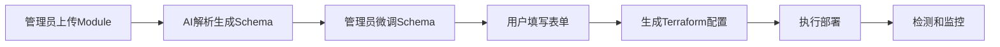
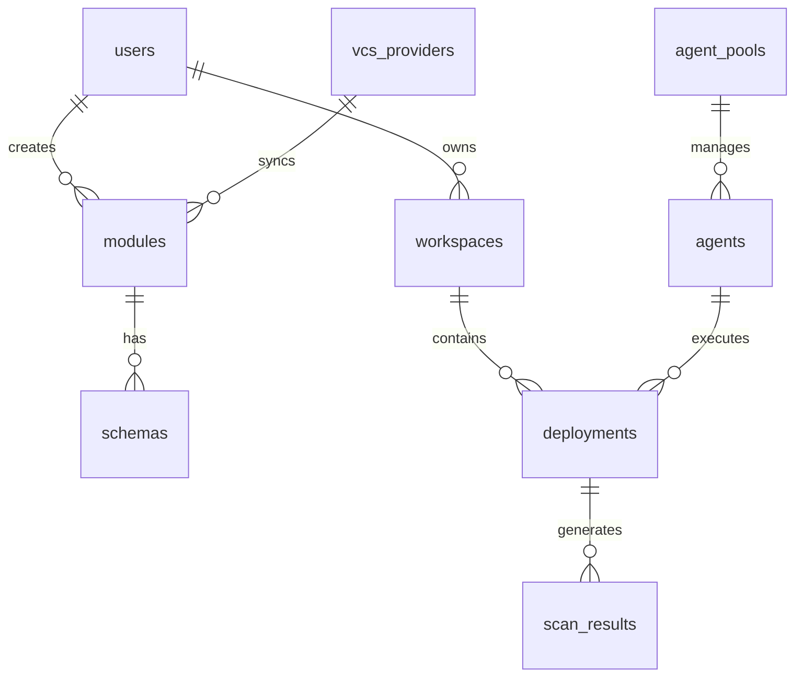

# 🤖 AI开发者快速入口

> **重要**: 这是AI开发者的快速入口文档，包含所有文档关系和开发上下文

## 📋 项目核心信息

**项目**: IaC平台 - AI驱动的表单化基础设施管理平台  
**状态**: 设计完成，开发0%  
**技术栈**: Go + React + PostgreSQL  
**核心特色**: AI解析Terraform Module → 自动生成表单 → 0门槛部署

## 🗂️ 文档导航图

```
📁 docs/
├── 🚀 QUICK_START_FOR_AI.md        ← 你在这里 (AI入口)
├── 📖 README.md                    ← 项目概览
├── 🎯 ai-development-guide.md      ← AI开发指导 (必读)
├── 📊 project-status.md            ← 项目状态跟踪 (必读)
├── 🏗️ development-guide.md         ← 完整开发指南
├── 🗄️ database-schema.sql          ← 数据库设计
├── 🔌 api-specification.md         ← API接口规范
├── 🧪 dynamic-schema-testing-guide.md ← 动态Schema测试指南 (新)
├── 📋 s3-module-demo-guide.md      ← S3标准示例指南 (参考)
├── 🤖 agent-architecture.md        ← Agent执行架构
├── 🔗 vcs-integration.md           ← VCS集成设计
└── 🎨 frontend-design-guide.md     ← 前端设计指导
```

## ⚡ 开发前必读清单

### 1️⃣ 首先阅读 (必须)
- `ai-development-guide.md` - 了解项目上下文，避免重复开发
- `project-status.md` - 确认当前进度和任务状态

### 2️⃣ 功能开发时参考
- `api-specification.md` - 严格按照API规范实现
- `database-schema.sql` - 使用已定义的表结构
- `development-guide.md` - 技术架构和实现细节

### 3️⃣ 特定功能参考
- `agent-architecture.md` - Agent相关功能开发
- `vcs-integration.md` - VCS集成功能开发
- `frontend-design-guide.md` - 前端UI设计规范

## 🎯 核心业务流程



## 📊 数据关系图



## 🔧 8大核心功能模块

| 模块 | 状态 | 文档位置 | API前缀 | 数据表 |
|------|------|----------|---------|--------|
| **用户认证** | 未开始 | api-specification.md#2 | `/auth` | users |
| **模块管理** | 未开始 | api-specification.md#3 | `/modules` | modules |
| **Schema管理** | 未开始 | api-specification.md#4 | `/schemas` | schemas |
| **AI解析** | 未开始 | api-specification.md#5 | `/ai-tasks` | ai_parse_tasks |
| **工作空间** | 未开始 | api-specification.md#6 | `/workspaces` | workspaces |
| **部署执行** | 未开始 | api-specification.md#7 | `/deployments` | deployments |
| **Agent管理** | 未开始 | agent-architecture.md | `/agents` | agents |
| **VCS集成** | 未开始 | vcs-integration.md | `/vcs-providers` | vcs_providers |

## 🚨 开发检查清单

### 开始任何开发任务前，必须确认：

```
 上下文检查:
- [ ] 功能在上述8大模块中已定义
- [ ] API接口在api-specification.md中已定义
- [ ] 数据表在database-schema.sql中已设计
- [ ] 项目状态在project-status.md中已确认

 避免重复开发:
- [ ] 检查功能是否已实现
- [ ] 确认当前任务的具体边界
- [ ] 明确只实现必需的功能
```

## 🎯 当前开发优先级

### 🔥 当前重点 (Phase 3 - 85%完成)
1. **测试动态Schema生成** - 使用 `dynamic-schema-testing-guide.md`
2. **完善AI解析功能** - 集成OpenAI API
3. **优化S3标准示例** - 参考 `s3-module-demo-guide.md`

### 🚀 接下来 (Phase 4)
1. **Agent执行系统** - 参考 `agent-architecture.md`
2. **VCS深度集成** - 参考 `vcs-integration.md`
3. **检测和监控** - 安全、成本、合规检查

## 📝 开发任务模板

```
任务: [具体功能描述]

 上下文检查:
- [ ] 功能已在8大模块中定义
- [ ] API接口已在api-specification.md中定义  
- [ ] 数据表结构已在database-schema.sql中确认
- [ ] 无重复开发风险
- [ ] 已阅读相关测试指南

📋 实现范围:
- 具体要实现的功能点1
- 具体要实现的功能点2

🔗 相关文档:
- API: [具体接口] (api-specification.md)
- 表: [具体表名] (database-schema.sql)
- 测试: [测试指南] (dynamic-schema-testing-guide.md)
- 标准: S3模块示例 (s3-module-demo-guide.md)

 注意事项:
- 只实现当前任务必需的功能
- 严格按照API规范实现
- 使用已定义的数据表结构
- 以S3模块为标准示例进行开发和测试
```

## 🔍 快速查找指南

### 需要实现API接口时
→ 查看 `api-specification.md` 找到对应接口定义

### 需要数据库操作时  
→ 查看 `database-schema.sql` 确认表结构

### 需要测试动态Schema功能时
→ 查看 `dynamic-schema-testing-guide.md` 了解测试流程

### 需要了解S3标准示例时
→ 查看 `s3-module-demo-guide.md` 了解开发规范

### 需要了解Agent执行时
→ 查看 `agent-architecture.md` 了解执行模式

### 需要VCS集成时
→ 查看 `vcs-integration.md` 了解集成方案

### 需要确认项目状态时
→ 查看 `project-status.md` 了解当前进度

### 需要整体架构信息时
→ 查看 `development-guide.md` 了解完整设计

### 需要前端UI设计时
→ 查看 `frontend-design-guide.md` 了解设计规范

### 需要前端用户体验规则时
→ 查看 `frontend-ux-rules.md` 了解UX开发规范

### 需要通知系统开发时
→ 查看 `notification-system-guide.md` 了解通知系统规范

### 需要字体设计规范时
→ 查看 `typography-guide.md` 了解字体使用指南

### 需要查看开发状态时
→ 查看 `project-status.md` 了解最新进度

### 需要S3 Module开发规范时
→ 查看 `s3-module-development-guide.md` 了解S3开发规范

### 需要前端表单风格规范时
→ 查看 `frontend-form-style-guide.md` 了解表单组件设计规范

### 需要Workspace模块开发时
→ 查看 `workspace/README.md` 了解Workspace完整设计（⭐ 新增）
→ 查看 `workspace/00-overview.md` 了解架构设计
→ 查看 `workspace/01-lifecycle.md` 了解生命周期状态机

### 需要Admin管理模块开发时
→ 查看 `admin/README.md` 了解Admin模块总览（⭐ 新增）
→ 查看 `admin/01-admin-management.md` 了解完整设计和需求（⭐ 主要文档）
→ 查看 `admin/02-api-specification.md` 了解API规范
→ 查看 `admin/development-progress.md` 了解开发进度
→ 参考 `workspace/09-api-specification.md` 了解API开发规范
→ 参考 `workspace/11-frontend-design.md` 了解前端设计规范

## 🚀 开始开发的标准流程

1. **阅读本文档** - 快速了解项目全貌
2. **检查项目状态** - 确认当前应该做什么
3. **确认功能设计** - 验证功能是否已设计
4. **查看API规范** - 确认接口定义
5. **检查数据库设计** - 确认表结构
6. **开始实现** - 按照设计文档实现
7. **更新状态** - 完成后更新project-status.md

##  重要提醒

- **不要重复设计** - 所有功能都已设计完成
- **不要偏离API** - 严格按照api-specification.md实现
- **不要创建新表** - 使用database-schema.sql中的表
- **不要过度实现** - 只实现当前任务必需的功能
- **及时更新状态** - 完成任务后更新project-status.md
- **🎯 使用S3标准** - 所有开发必须以S3模块为标准示例
- **🧪 先测试后开发** - 使用dynamic-schema-testing-guide.md验证功能

## 🎨 前端设计指导

###  已完成的现代化设计
- **极简现代风格** - 参考Notion + Tailwind UI实现
- **统一设计系统** - CSS变量 + 模块化架构
- **现代化页面** - 登录页、布局、仪表板已重设计
- **原生HTML/CSS** - 摆脱Ant Design，更轻量高效

### 设计系统规范
```css
/* 已实现的设计变量 */
--color-white: #FFFFFF;        /* 主背景色 */
--color-gray-50: #F8F9FA;      /* 页面背景 */
--color-blue-500: #3B82F6;     /* 主要强调色 */
--spacing-md: 16px;            /* 标准间距 */
--radius-lg: 12px;             /* 卡片圆角 */
--shadow-md: 0 4px 6px rgba(0, 0, 0, 0.07); /* 卡片阴影 */
```

### 已实现的页面
- **登录页面**  - 居中卡片 + 渐变背景 + 原生表单验证
- **主布局**  - 左侧导航 + 动态标题 + 用户头像菜单
- **仪表板**  - 统计卡片 + 快速操作网格 + 悬停效果

### 开发规范
1. **CSS Modules** - 组件样式隔离 (*.module.css)
2. **设计变量** - 统一使用CSS变量系统
3. **TypeScript** - 完整的类型安全
4. **响应式** - 移动端适配
5. **永远保留用户输入** - 即使出现错误，也不清空用户已输入的内容
6. **统一通知系统** - 所有报错/成功信息在左下角矩形框展示，5秒超时，鼠标悬停保持，点击可复制
7. **统一字体系统** - 主字体Inter，标题Poppins，代码JetBrains Mono，使用CSS变量管理

### 快速启动
```bash
# 启动前端开发服务器
cd frontend && npm run dev
# 访问: http://localhost:5173
# 测试账户: admin / admin123
```

---

**🎯 记住**: 这个项目的所有设计都已完成，你的任务是按照设计文档进行实现，而不是重新设计！
