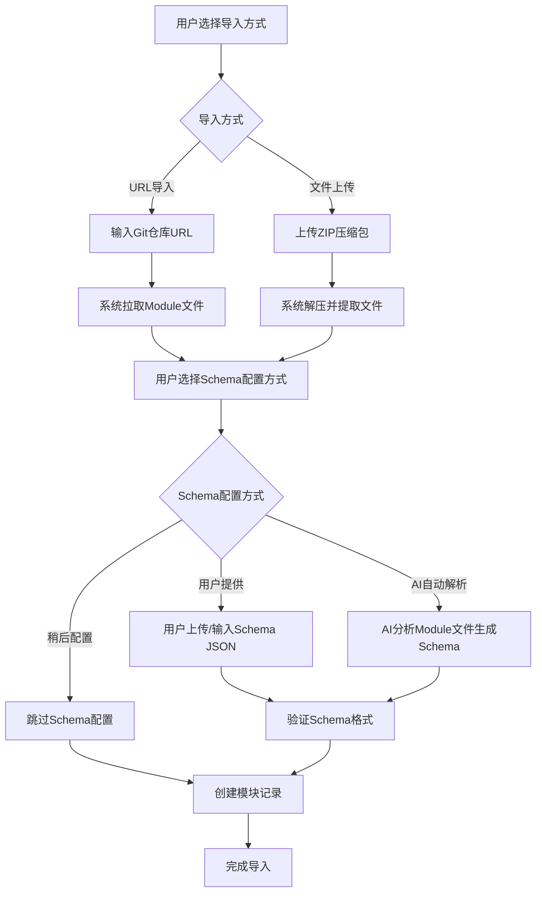

# IaC平台开发文档

## 1. 项目概述

### 1.1 产品定位
打造一个前后端分离的IaC平台，提供表单化的基础设施资源创建能力，通过AI解析Terraform Module自动生成Schema，实现0门槛的基础设施管理。

### 🎯 关于Demo示例的重要说明
**重要**: S3 Module仅作为开发测试的Demo示例
- `demo/s3_module.go` 是一个完整的示例，用于测试动态Schema系统
- S3不是产品功能，只是用来验证系统能力的示例
- 所有S3相关的代码和文档都是为了演示如何处理复杂的Terraform Module
- 实际产品中，用户可以导入任何Terraform Module，不限于S3

**开发原则**：
1. 不要为特定Module（如S3）硬编码逻辑
2. 所有功能必须是通用的，能处理任何Module
3. S3只是因为它复杂（80+参数），适合作为测试用例
4. 生产环境中，Schema应该由AI动态生成或用户提供

### 1.2 核心特性
- **0门槛使用**：屏蔽HCL语法，纯表单化操作
- **AI驱动**：自动解析Terraform Module生成Schema
- **渐进式表单**：基础参数+高级选项的分层设计
- **无限嵌套**：支持复杂对象的深度嵌套表单渲染
- **平台化管理**：管理员可维护Schema，支持版本控制
- **集成检测**：内置风险、成本、合规检查

## 2. 技术架构

### 2.1 整体架构
```
┌─────────────────┐    ┌─────────────────┐    ┌─────────────────┐
│   React前端     │    │   Golang后端    │    │  PostgreSQL     │
│                 │    │                 │    │                 │
│ - 动态表单渲染  │◄──►│ - AI解析引擎    │◄──►│ - Schema存储    │
│ - 无限嵌套组件  │    │ - Schema管理    │    │ - 版本管理      │
│ - 检测集成      │    │ - Terraform执行 │    │ - 状态管理      │
└─────────────────┘    └─────────────────┘    └─────────────────┘
```

### 2.2 优化后的模块导入流程

#### 理想的模块导入流程


#### 完整业务流程
```
模块导入 → Schema配置 → 表单渲染 → 用户填写 → JSON输出 → Terraform执行 → 检测监控
```

## 3. 技术栈

### 3.1 前端技术栈
- **框架**：React 18+ with TypeScript
- **状态管理**：Redux Toolkit / Zustand
- **UI组件库**：Ant Design / Material-UI
- **表单处理**：React Hook Form + Yup验证
- **构建工具**：Vite
- **样式方案**：Tailwind CSS

### 3.2 后端技术栈
- **语言**：Go 1.21+
- **Web框架**：Gin
- **ORM**：GORM
- **数据库**：PostgreSQL 15+
- **AI集成**：OpenAI API / 本地LLM
- **Terraform集成**：terraform-exec
- **配置管理**：Viper

### 3.3 基础设施
- **容器化**：Docker + Docker Compose
- **CI/CD**：GitHub Actions
- **监控**：Prometheus + Grafana
- **日志**：ELK Stack

## 4. 数据库设计

### 4.1 核心表结构

```sql
-- 模块表 (优化后)
CREATE TABLE modules (
    id SERIAL PRIMARY KEY,
    name VARCHAR(100) NOT NULL,
    provider VARCHAR(50) NOT NULL,
    description TEXT,
    import_type VARCHAR(20) NOT NULL, -- 'url' or 'upload'
    source_url VARCHAR(500),          -- Git仓库URL (url导入时)
    module_files JSONB,               -- 模块文件内容
    sync_status VARCHAR(20) DEFAULT 'completed',
    created_at TIMESTAMP DEFAULT NOW(),
    updated_at TIMESTAMP DEFAULT NOW(),
    UNIQUE(name, provider)
);

-- Schema表
CREATE TABLE schemas (
    id SERIAL PRIMARY KEY,
    module_id INTEGER REFERENCES modules(id),
    schema_data JSONB NOT NULL,
    version VARCHAR(20) NOT NULL,
    status VARCHAR(20) DEFAULT 'draft', -- draft, active, deprecated
    created_by INTEGER,
    created_at TIMESTAMP DEFAULT NOW(),
    updated_at TIMESTAMP DEFAULT NOW()
);

-- 工作空间表
CREATE TABLE workspaces (
    id SERIAL PRIMARY KEY,
    name VARCHAR(100) NOT NULL,
    description TEXT,
    state_backend VARCHAR(20) NOT NULL, -- local, s3, remote
    state_config JSONB,
    created_by INTEGER,
    created_at TIMESTAMP DEFAULT NOW(),
    updated_at TIMESTAMP DEFAULT NOW()
);

-- 部署记录表
CREATE TABLE deployments (
    id SERIAL PRIMARY KEY,
    workspace_id INTEGER REFERENCES workspaces(id),
    module_id INTEGER REFERENCES modules(id),
    schema_id INTEGER REFERENCES schemas(id),
    config_data JSONB NOT NULL,
    terraform_output JSONB,
    status VARCHAR(20) NOT NULL, -- pending, running, success, failed
    created_by INTEGER,
    created_at TIMESTAMP DEFAULT NOW(),
    updated_at TIMESTAMP DEFAULT NOW()
);

-- 检测结果表
CREATE TABLE scan_results (
    id SERIAL PRIMARY KEY,
    deployment_id INTEGER REFERENCES deployments(id),
    scan_type VARCHAR(20) NOT NULL, -- security, cost, compliance
    results JSONB NOT NULL,
    score INTEGER,
    created_at TIMESTAMP DEFAULT NOW()
);
```

### 4.2 索引设计
```sql
-- Schema查询优化
CREATE INDEX idx_schemas_module_version ON schemas(module_id, version);
CREATE INDEX idx_schemas_status ON schemas(status);

-- 部署记录查询优化
CREATE INDEX idx_deployments_workspace ON deployments(workspace_id);
CREATE INDEX idx_deployments_status ON deployments(status);
CREATE INDEX idx_deployments_created_at ON deployments(created_at);

-- JSONB字段索引
CREATE INDEX idx_schemas_data_gin ON schemas USING GIN(schema_data);
CREATE INDEX idx_deployments_config_gin ON deployments USING GIN(config_data);
```

## 5. API设计

### 5.1 优化后的模块导入API

#### 模块导入API (简化版)
```http
# 模块导入 - 支持URL和文件上传两种方式
POST /api/v1/modules/import
Content-Type: multipart/form-data

# 方式1: URL导入
{
  "import_type": "url",
  "source_url": "https://github.com/terraform-aws-modules/terraform-aws-s3-bucket",
  "branch": "main",
  "name": "s3-bucket",
  "provider": "aws",
  "description": "AWS S3 bucket module",
  "schema_option": "ai_generate" | "user_provided" | "skip"
}

# 方式2: 文件上传
{
  "import_type": "upload",
  "module_file": <ZIP文件>,
  "name": "s3-bucket", 
  "provider": "aws",
  "description": "AWS S3 bucket module",
  "schema_option": "ai_generate" | "user_provided" | "skip"
}
```

#### Schema配置API
```http
# 如果选择用户提供Schema
POST /api/v1/modules/{id}/schema
Content-Type: application/json

{
  "schema_data": {
    "name": {
      "type": "string",
      "required": true,
      "description": "Bucket name"
    }
  }
}

# 如果选择AI生成Schema
POST /api/v1/modules/{id}/generate-schema
Content-Type: application/json

{
  "ai_provider": "openai",
  "model": "gpt-4",
  "options": {
    "include_advanced": true,
    "generate_defaults": true
  }
}
```

### 5.2 RESTful API规范
```
# 模块管理
POST   /api/v1/modules/import             # 导入模块 (新)
GET    /api/v1/modules                    # 获取模块列表
GET    /api/v1/modules/{id}               # 获取模块详情
PUT    /api/v1/modules/{id}               # 更新模块
DELETE /api/v1/modules/{id}               # 删除模块

# Schema管理
GET    /api/v1/modules/{id}/schemas       # 获取模块Schema
POST   /api/v1/modules/{id}/schema        # 手动创建Schema (新)
POST   /api/v1/modules/{id}/generate-schema # AI生成Schema (新)
GET    /api/v1/schemas/{id}               # 获取Schema详情
PUT    /api/v1/schemas/{id}               # 更新Schema
POST   /api/v1/schemas/{id}/validate      # 验证Schema

# 工作空间管理
GET    /api/v1/workspaces                 # 获取工作空间列表
POST   /api/v1/workspaces                 # 创建工作空间

# 部署管理
POST   /api/v1/deployments                # 创建部署
GET    /api/v1/deployments/{id}           # 获取部署详情
POST   /api/v1/deployments/{id}/scan      # 执行检测
```

### 5.2 数据传输格式
```json
{
  "code": 200,
  "message": "success",
  "data": {},
  "timestamp": "2024-01-01T00:00:00Z"
}
```

## 6. 前端组件设计

### 6.1 核心组件

#### 模块导入向导组件
```typescript
// 模块导入向导组件
interface ModuleImportWizardProps {
  onComplete: (moduleId: number) => void;
  onCancel: () => void;
}

// 步骤1: 选择导入方式
interface ImportMethodStepProps {
  importType: 'url' | 'upload';
  onImportTypeChange: (type: 'url' | 'upload') => void;
  onNext: (moduleData: ModuleImportData) => void;
}

// 步骤2: Schema配置
interface SchemaConfigStepProps {
  moduleId: number;
  schemaOption: 'ai' | 'manual' | 'skip';
  onSchemaOptionChange: (option: 'ai' | 'manual' | 'skip') => void;
  onComplete: () => void;
}

// URL导入表单
interface UrlImportFormProps {
  onSubmit: (data: UrlImportData) => void;
}

// 文件上传表单
interface FileUploadFormProps {
  onSubmit: (data: FileUploadData) => void;
}
```

#### 动态表单组件
```typescript
// 动态表单组件
interface DynamicFormProps {
  schema: Schema;
  initialValues?: any;
  onSubmit: (values: any) => void;
  onValidate?: (errors: any) => void;
}

// 嵌套对象组件
interface NestedObjectProps {
  schema: Schema;
  value: any;
  onChange: (value: any) => void;
  path: string[];
}

// Schema编辑器组件
interface SchemaEditorProps {
  schema: Schema;
  onChange: (schema: Schema) => void;
  readonly?: boolean;
}
```

### 6.2 状态管理
```typescript
interface AppState {
  modules: Module[];
  schemas: Record<string, Schema>;
  workspaces: Workspace[];
  currentDeployment: Deployment | null;
  ui: {
    loading: boolean;
    errors: string[];
  };
}
```

## 7. 动态Schema生成架构

### 7.1 架构概述
**重要变更**: 不再使用硬编码的Schema生成，改为完全动态的、基于数据库的Schema管理系统。

```
用户提交Module → AI解析Module文件 → 生成Schema JSON → 存储到数据库 → 前端动态渲染表单
```

### 7.2 动态生成流程
```
1. 用户创建Module记录（包含VCS信息）
2. 系统从VCS同步Module文件到module_files字段
3. AI解析引擎分析Module文件内容：
   - 解析variables.tf获取参数定义
   - 分析main.tf了解资源使用模式
   - 提取注释和文档信息
   - 识别参数类型、默认值、验证规则
4. 生成标准化Schema JSON结构
5. 将Schema存储到schemas表的schema_data字段
6. 前端基于数据库中的Schema动态渲染表单
```

### 7.3 数据库Schema存储结构
```sql
-- schemas表存储动态生成的Schema配置
CREATE TABLE schemas (
    id SERIAL PRIMARY KEY,
    module_id INTEGER REFERENCES modules(id),
    schema_data JSONB NOT NULL,  -- 动态生成的Schema JSON
    version VARCHAR(20) NOT NULL,
    status VARCHAR(20) DEFAULT 'draft',
    ai_generated BOOLEAN DEFAULT true,  -- 标记为AI生成
    created_at TIMESTAMP DEFAULT NOW()
);

-- modules表存储Module文件内容
CREATE TABLE modules (
    id SERIAL PRIMARY KEY,
    name VARCHAR(100) NOT NULL,
    provider VARCHAR(50) NOT NULL,
    module_files JSONB,  -- 存储从VCS同步的Module文件内容
    sync_status VARCHAR(20) DEFAULT 'pending'
);
```

### 7.4 Schema JSON标准格式
```json
{
  "field_name": {
    "type": "string|number|boolean|object|array",
    "required": true|false,
    "description": "字段描述",
    "default": "默认值",
    "hiddenDefault": true|false,  // 是否为高级选项
    "options": ["选项1", "选项2"],  // select类型的选项
    "properties": {  // object类型的嵌套属性
      "nested_field": { ... }
    },
    "items": { ... }  // array类型的元素定义
  }
}
```

### 7.5 AI解析提示词模板
```
你是一个Terraform Module分析专家。请分析以下Module文件，生成标准化的Schema配置。

Module信息：
- Name: {module_name}
- Provider: {provider}
- Version: {version}

Module文件内容：
{module_files_json}

请生成符合以下格式的Schema JSON：
{
  "field_name": {
    "type": "string|number|boolean|object|array",
    "required": boolean,
    "description": "string",
    "default": any,
    "hiddenDefault": boolean,
    "options": ["array for select type"],
    "properties": {"object for nested fields"},
    "items": {"object for array elements"}
  }
}

分析要求：
1. 从variables.tf提取所有参数定义
2. 识别参数类型（string/number/bool/object/list）
3. 提取description和default值
4. 识别复杂对象的嵌套结构
5. 标记高级选项为hiddenDefault=true
6. 为select类型生成合理的options数组
7. 确保生成的Schema可以直接用于前端表单渲染

输出纯JSON格式，不要包含任何解释文字。
```

### 7.6 实现架构对比

#### 🚫 旧架构（硬编码）
```go
// ❌ 硬编码方式 - 不灵活，难维护
func (s *SchemaService) generateS3Schema() map[string]interface{} {
    return map[string]interface{}{
        "name": map[string]interface{}{
            "type": "string",
            "required": false,
            "description": "S3存储桶名称",
        },
        // ... 更多硬编码字段
    }
}
```

####  新架构（动态生成）
```go
//  动态生成方式 - 灵活，可扩展
func (s *SchemaService) GenerateSchemaFromModule(moduleID uint) (*models.Schema, error) {
    // 1. 获取Module及其文件内容
    module, err := s.getModuleWithFiles(moduleID)
    if err != nil {
        return nil, err
    }
    
    // 2. 调用AI解析引擎
    schemaData, err := s.aiService.ParseModuleToSchema(module.ModuleFiles)
    if err != nil {
        return nil, err
    }
    
    // 3. 存储到数据库
    schema := &models.Schema{
        ModuleID:     moduleID,
        SchemaData:   schemaData,  // 动态生成的JSON
        AIGenerated:  true,
        Status:       "active",
    }
    
    return s.db.Create(schema).Error
}
```

## 8. 开发规范

### 8.1 代码规范
- **Go**: 遵循Go官方代码规范，使用gofmt格式化
- **TypeScript**: 使用ESLint + Prettier，严格类型检查
- **提交规范**: 使用Conventional Commits
- **功能开关**: 所有新功能必须支持开关控制

### 8.2 功能开关机制

#### 8.2.1 前端功能开关
```typescript
// src/config/features.ts
export const FEATURES = {
  TOAST_NOTIFICATIONS: false,  // Toast通知系统
  ADVANCED_FORMS: false,       // 高级表单功能
  AI_PARSING: false,           // AI解析功能
  REAL_TIME_UPDATES: false,    // 实时更新
  DARK_MODE: false,            // 暗色主题
} as const;

// 使用示例
import { FEATURES } from '../config/features';

const MyComponent = () => {
  return (
    <div>
      {FEATURES.TOAST_NOTIFICATIONS && (
        <Toast message="功能已启用" type="success" />
      )}
      {!FEATURES.TOAST_NOTIFICATIONS && (
        <div>使用传统alert通知</div>
      )}
    </div>
  );
};
```

#### 8.2.2 后端功能开关
```go
// internal/config/features.go
type Features struct {
    AIParsingEnabled     bool `mapstructure:"ai_parsing_enabled"`
    RealTimeUpdates     bool `mapstructure:"real_time_updates"`
    AdvancedValidation  bool `mapstructure:"advanced_validation"`
    MetricsCollection   bool `mapstructure:"metrics_collection"`
}

// 使用示例
func (s *ModuleService) CreateModule(module *models.Module) error {
    if config.Features.AdvancedValidation {
        if err := s.validateAdvanced(module); err != nil {
            return err
        }
    }
    return s.db.Create(module).Error
}
```

#### 8.2.3 环境变量配置
```bash
# .env 文件
# 前端功能开关
VITE_FEATURE_TOAST_NOTIFICATIONS=false
VITE_FEATURE_ADVANCED_FORMS=false
VITE_FEATURE_AI_PARSING=false

# 后端功能开关
FEATURE_AI_PARSING_ENABLED=false
FEATURE_REAL_TIME_UPDATES=false
FEATURE_ADVANCED_VALIDATION=false
```

#### 8.2.4 开发流程规范

**新功能开发步骤**:
1. **创建功能开关**: 在features配置中添加新功能开关，默认为false
2. **条件渲染**: 使用功能开关包装新功能代码
3. **渐进式启用**: 先在开发环境测试，再逐步启用
4. **回滚机制**: 出现问题时可立即禁用功能
5. **清理代码**: 功能稳定后移除开关，合并到主流程

**代码示例模板**:
```typescript
// ❌ 错误做法 - 直接添加新功能
const MyComponent = () => {
  const { toast, success, error } = useToast(); // 可能导致白屏
  return <Toast />;
};

//  正确做法 - 使用功能开关
const MyComponent = () => {
  if (FEATURES.TOAST_NOTIFICATIONS) {
    const { toast, success, error } = useToast();
    return <Toast />;
  }
  return <div>传统通知方式</div>;
};
```

#### 8.2.5 功能开关管理

**开关命名规范**:
- 使用大写字母和下划线
- 功能描述要清晰明确
- 避免过于细粒度的开关

**开关生命周期**:
1. **实验阶段**: 默认关闭，仅开发环境启用
2. **测试阶段**: 部分用户启用，收集反馈
3. **发布阶段**: 全量启用，监控稳定性
4. **稳定阶段**: 移除开关，合并到主代码

**紧急回滚**:
```bash
# 快速禁用有问题的功能
echo "VITE_FEATURE_TOAST_NOTIFICATIONS=false" >> .env
# 重启前端服务
npm run dev
```


- **单元测试**: 覆盖率>80%
- **集成测试**: API接口测试
- **E2E测试**: 关键用户流程测试

### 8.3 部署策略
- **开发环境**: Docker Compose本地部署
- **测试环境**: Kubernetes部署
- **生产环境**: 蓝绿部署

## 9. 开发计划

### Phase 1: 基础架构 (4周)
- [ ] 数据库设计和初始化
- [ ] 后端API框架搭建
- [ ] 前端项目初始化
- [ ] 基础CRUD功能

### Phase 2: AI解析引擎 (6周)
- [ ] Terraform文件解析器
- [ ] AI集成和提示词优化
- [ ] Schema生成和验证
- [ ] 管理员Schema编辑界面

### Phase 3: 动态表单系统 (8周)
- [ ] 基础表单组件开发
- [ ] 无限嵌套组件实现
- [ ] 表单验证和联动
- [ ] 渐进式显示逻辑

### Phase 4: Terraform集成 (4周)
- [ ] Terraform执行引擎
- [ ] 状态管理
- [ ] 工作空间隔离
- [ ] 部署历史记录

### Phase 5: 检测和优化 (4周)
- [ ] 安全检测集成
- [ ] 成本分析
- [ ] 合规检查
- [ ] 性能优化

## 10. 风险评估

### 10.1 技术风险
- **AI解析准确性**: 复杂Module解析可能不准确
- **无限嵌套性能**: 深度嵌套可能影响前端性能
- **Terraform兼容性**: 不同版本兼容性问题

### 10.2 缓解措施
- 提供Schema手动编辑功能
- 实现虚拟滚动和懒加载
- 支持多版本Terraform

## 11. 动态Schema开发规范

### 11.1 Schema模板系统
为了确保AI生成的Schema质量和一致性，建立Schema模板系统：

```json
// Schema模板存储在system_configs表中
{
  "key": "schema_templates",
  "value": {
    "aws_s3": {
      "name": { "type": "string", "required": false },
      "tags": { "type": "object", "required": true },
      "lifecycle_rule": { "type": "array", "hiddenDefault": true }
    },
    "aws_vpc": {
      "cidr_block": { "type": "string", "required": true },
      "enable_dns_hostnames": { "type": "boolean", "default": true }
    }
  }
}
```

### 11.2 AI解析质量保证
1. **模板匹配**: AI首先尝试匹配已知的模板模式
2. **字段验证**: 验证生成的Schema字段类型和结构
3. **默认值推断**: 基于Terraform最佳实践设置合理默认值
4. **嵌套结构处理**: 正确处理复杂的嵌套对象和数组
5. **高级选项标记**: 自动识别并标记高级配置选项

### 11.3 Schema版本管理
```sql
-- 支持Schema版本演进
INSERT INTO schemas (module_id, version, schema_data, status) VALUES
(1, '1.0.0', '{"name": {...}}', 'deprecated'),
(1, '1.1.0', '{"name": {...}, "new_field": {...}}', 'active');
```

### 11.4 开发规范要求
- **不再硬编码**: 所有Schema必须通过AI解析或手动创建存储在数据库
- **模板驱动**: 使用Schema模板确保生成质量
- **版本控制**: 支持Schema版本演进和向后兼容
- **动态渲染**: 前端完全基于数据库Schema动态渲染表单
- **AI优先**: 优先使用AI解析，人工微调为辅

### 11.5 相关文件和接口
- `POST /api/v1/modules/{id}/generate` - AI生成Schema
- `GET /api/v1/modules/{id}/schemas` - 获取Module的所有Schema版本
- `PUT /api/v1/schemas/{id}` - 手动编辑Schema
- `schemas.schema_data` - JSONB字段存储Schema配置
- `modules.module_files` - JSONB字段存储Module文件内容

### 11.6 Demo Module开发规范
**重要**: 使用Demo Module进行开发测试时，请参考：
- 📚 **[Demo Module开发规范](./demo-module-development-guide.md)** - 使用demo进行开发的指南
- 核心规则：**生成JSON数据使用test函数而不是手动生成JSON数据**
- Demo使用S3作为示例，因为它足够复杂（80+参数）
- 实际产品中应支持任何Terraform Module，不限于S3

#### 插入Demo数据到数据库

**快速方法（推荐）**：
```bash
# 1. 生成schema JSON
cd backend/cmd/generate_s3_schema && go run main.go

# 2. 使用脚本插入数据库
chmod +x scripts/insert_s3_schema.sh
./scripts/insert_s3_schema.sh

# 3. 验证数据
psql -U postgres -d iac_platform -c "SELECT COUNT(*) FROM schemas WHERE module_id = 6;"
```

**手动方法**：
```bash
# 1. 生成schema
cd backend/cmd/generate_s3_schema && go run main.go

# 2. 提取schema部分
cat s3_schema.json | jq '.schema' > schema_only.json

# 3. 使用psql插入
psql -U postgres -d iac_platform <<EOF
INSERT INTO schemas (module_id, schema_data, version, status, ai_generated, created_by)
VALUES (6, '$(cat schema_only.json)'::jsonb, '2.0.0', 'active', false, 1);
EOF
```

**注意事项**：
- 这只是开发测试用的临时方案
- 生产环境应该通过API或AI自动生成Schema
- module_id=6 是预留给S3 demo的ID

## 12. 相关文档

### 12.1 功能指南
- 📚 **[Module导入功能指南](./schema-import-capability-4-guide.md)** - JSON配置导入完整指南
- 📚 **[实时名称检查功能](./module-import-realtime-check-guide.md)** - 模块名称实时检查功能详解
- 📚 **[Demo Module开发规范](./demo-module-development-guide.md)** - 使用demo进行开发的指南
- 📚 **[嵌套Schema渲染指南](./nested-schema-rendering-guide.md)** - 多层嵌套表单渲染实现
- 📚 **[Hidden Default功能](./hidden-default-feature-guide.md)** - 渐进式表单实现指南

### 12.2 项目状态
- 📊 **[项目状态文档](./project-status.md)** - 项目进度和更新日志
- 📋 **[API规范文档](./api-specification.md)** - 完整的API接口规范
- 🏗️ **[数据库Schema](./database-schema.sql)** - 数据库表结构定义

### 12.3 设计指南
- 🎨 **[前端设计指南](./frontend-design-guide.md)** - UI/UX设计规范
- 📝 **[前端表单样式指南](./frontend-form-style-guide.md)** - 表单组件样式规范
- 🔧 **[AI开发指导](./ai-development-guide.md)** - AI辅助开发最佳实践

## 13. 监控和运维

### 13.1 关键指标
- API响应时间
- Schema解析成功率
- 部署成功率
- 用户活跃度

### 13.2 告警规则
- API错误率>5%
- 数据库连接数>80%
- 磁盘使用率>85%
- 内存使用率>90%
