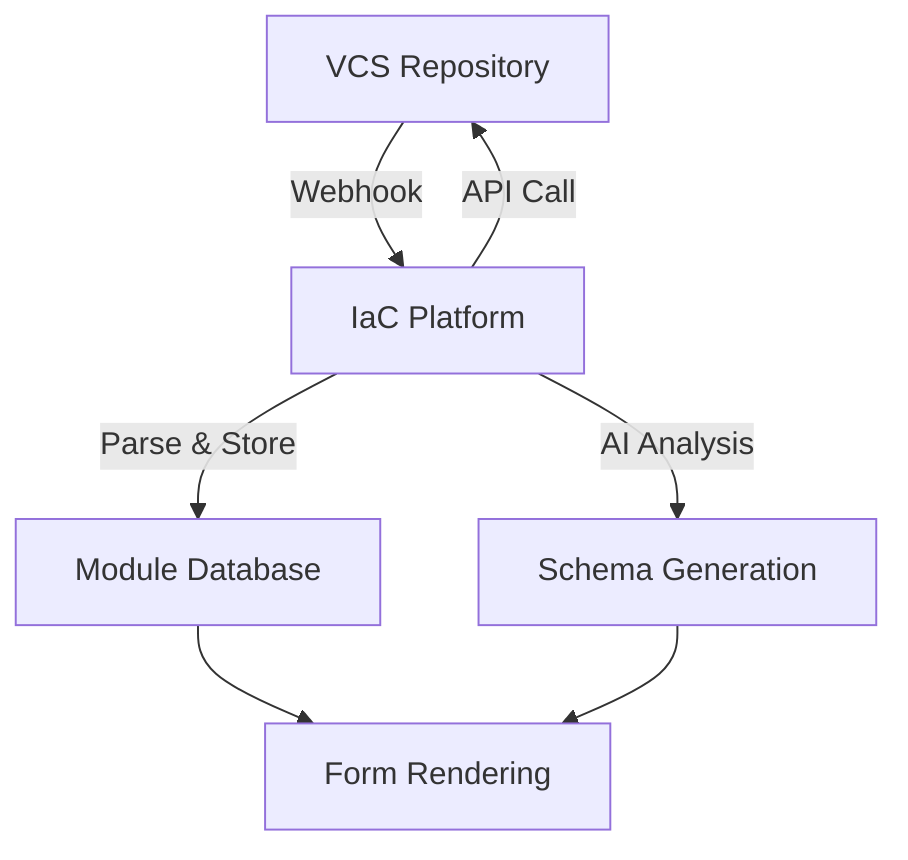
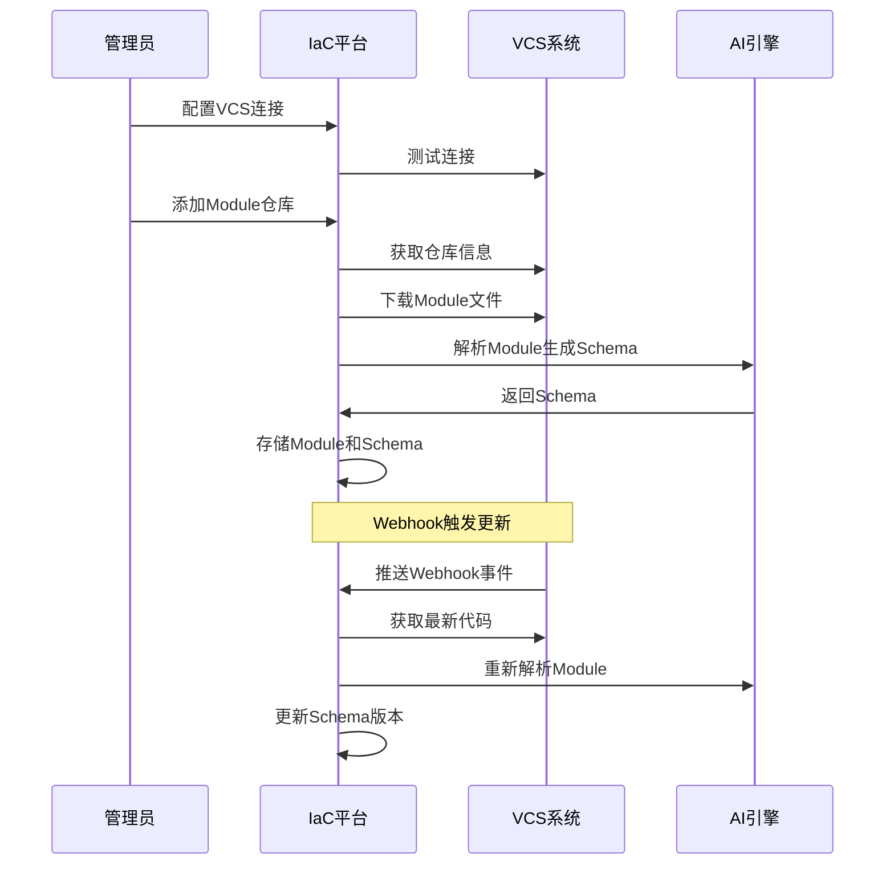

# VCS集成设计文档

## 1. VCS集成概述

IaC平台支持从版本控制系统自动同步Terraform Module，支持主流的VCS提供商：

- **GitHub** - 公有云和企业版
- **GitLab** - 公有云和私有部署
- **Bitbucket** - Atlassian平台
- **Azure DevOps** - 微软平台
- **Gitea/Forgejo** - 轻量级自托管

## 2. VCS集成架构

### 2.1 整体架构



### 2.2 数据流程



## 3. VCS提供商适配

### 3.1 GitHub集成

```go
// GitHub API客户端
type GitHubProvider struct {
    BaseURL    string
    Token      string
    Client     *github.Client
}

func NewGitHubProvider(baseURL, token string) *GitHubProvider {
    client := github.NewClient(nil)
    if baseURL != "" {
        // 企业版GitHub
        client.BaseURL, _ = url.Parse(baseURL)
    }
    client = client.WithAuthToken(token)
    
    return &GitHubProvider{
        BaseURL: baseURL,
        Token:   token,
        Client:  client,
    }
}

func (g *GitHubProvider) GetRepositories(ctx context.Context, search string) ([]*Repository, error) {
    opts := &github.RepositoryListOptions{
        Type: "all",
        ListOptions: github.ListOptions{PerPage: 100},
    }
    
    var allRepos []*Repository
    for {
        repos, resp, err := g.Client.Repositories.List(ctx, "", opts)
        if err != nil {
            return nil, err
        }
        
        for _, repo := range repos {
            if search == "" || strings.Contains(*repo.Name, search) {
                allRepos = append(allRepos, &Repository{
                    Name:        *repo.Name,
                    FullName:    *repo.FullName,
                    CloneURL:    *repo.CloneURL,
                    DefaultBranch: *repo.DefaultBranch,
                    Private:     *repo.Private,
                })
            }
        }
        
        if resp.NextPage == 0 {
            break
        }
        opts.Page = resp.NextPage
    }
    
    return allRepos, nil
}

func (g *GitHubProvider) GetFileContent(ctx context.Context, owner, repo, path, ref string) ([]byte, error) {
    fileContent, _, _, err := g.Client.Repositories.GetContents(
        ctx, owner, repo, path, &github.RepositoryContentGetOptions{Ref: ref},
    )
    if err != nil {
        return nil, err
    }
    
    content, err := fileContent.GetContent()
    if err != nil {
        return nil, err
    }
    
    return []byte(content), nil
}

func (g *GitHubProvider) GetDirectoryContents(ctx context.Context, owner, repo, path, ref string) ([]*FileInfo, error) {
    _, directoryContent, _, err := g.Client.Repositories.GetContents(
        ctx, owner, repo, path, &github.RepositoryContentGetOptions{Ref: ref},
    )
    if err != nil {
        return nil, err
    }
    
    var files []*FileInfo
    for _, content := range directoryContent {
        files = append(files, &FileInfo{
            Name: *content.Name,
            Path: *content.Path,
            Type: *content.Type, // "file" or "dir"
            Size: *content.Size,
        })
    }
    
    return files, nil
}
```

### 3.2 GitLab集成

```go
// GitLab API客户端
type GitLabProvider struct {
    BaseURL string
    Token   string
    Client  *gitlab.Client
}

func NewGitLabProvider(baseURL, token string) (*GitLabProvider, error) {
    client, err := gitlab.NewClient(token, gitlab.WithBaseURL(baseURL))
    if err != nil {
        return nil, err
    }
    
    return &GitLabProvider{
        BaseURL: baseURL,
        Token:   token,
        Client:  client,
    }, nil
}

func (g *GitLabProvider) GetRepositories(ctx context.Context, search string) ([]*Repository, error) {
    opts := &gitlab.ListProjectsOptions{
        Search:     &search,
        Membership: gitlab.Bool(true),
        ListOptions: gitlab.ListOptions{PerPage: 100},
    }
    
    var allRepos []*Repository
    for {
        projects, resp, err := g.Client.Projects.ListProjects(opts)
        if err != nil {
            return nil, err
        }
        
        for _, project := range projects {
            allRepos = append(allRepos, &Repository{
                Name:          project.Name,
                FullName:      project.PathWithNamespace,
                CloneURL:      project.HTTPURLToRepo,
                DefaultBranch: project.DefaultBranch,
                Private:       project.Visibility != gitlab.PublicVisibility,
            })
        }
        
        if resp.NextPage == 0 {
            break
        }
        opts.Page = resp.NextPage
    }
    
    return allRepos, nil
}
```

### 3.3 通用VCS接口

```go
// VCS提供商接口
type VCSProvider interface {
    // 测试连接
    TestConnection(ctx context.Context) error
    
    // 获取仓库列表
    GetRepositories(ctx context.Context, search string) ([]*Repository, error)
    
    // 获取分支列表
    GetBranches(ctx context.Context, owner, repo string) ([]*Branch, error)
    
    // 获取文件内容
    GetFileContent(ctx context.Context, owner, repo, path, ref string) ([]byte, error)
    
    // 获取目录内容
    GetDirectoryContents(ctx context.Context, owner, repo, path, ref string) ([]*FileInfo, error)
    
    // 创建Webhook
    CreateWebhook(ctx context.Context, owner, repo, webhookURL string) (*Webhook, error)
    
    // 删除Webhook
    DeleteWebhook(ctx context.Context, owner, repo string, webhookID int) error
}

// 仓库信息
type Repository struct {
    Name          string `json:"name"`
    FullName      string `json:"full_name"`
    CloneURL      string `json:"clone_url"`
    DefaultBranch string `json:"default_branch"`
    Private       bool   `json:"private"`
}

// 分支信息
type Branch struct {
    Name   string `json:"name"`
    Commit string `json:"commit"`
}

// 文件信息
type FileInfo struct {
    Name string `json:"name"`
    Path string `json:"path"`
    Type string `json:"type"` // "file" or "dir"
    Size int    `json:"size"`
}

// Webhook信息
type Webhook struct {
    ID     int    `json:"id"`
    URL    string `json:"url"`
    Events []string `json:"events"`
}
```

## 4. Module同步机制

### 4.1 同步策略

```go
// Module同步器
type ModuleSyncer struct {
    vcsProviders map[int]VCSProvider
    aiEngine     AIEngine
    db          *gorm.DB
}

func (s *ModuleSyncer) SyncModule(ctx context.Context, moduleID int) error {
    module, err := s.getModule(moduleID)
    if err != nil {
        return err
    }
    
    provider := s.vcsProviders[module.VCSProviderID]
    if provider == nil {
        return errors.New("VCS provider not found")
    }
    
    // 更新同步状态
    module.SyncStatus = "syncing"
    s.db.Save(module)
    
    // 获取Module文件
    files, err := s.downloadModuleFiles(ctx, provider, module)
    if err != nil {
        module.SyncStatus = "failed"
        s.db.Save(module)
        return err
    }
    
    // 存储文件内容
    module.ModuleFiles = files
    module.LastSyncAt = time.Now()
    module.SyncStatus = "synced"
    s.db.Save(module)
    
    // 触发AI解析
    go s.triggerAIAnalysis(module)
    
    return nil
}

func (s *ModuleSyncer) downloadModuleFiles(ctx context.Context, provider VCSProvider, module *Module) (map[string]string, error) {
    // 解析仓库信息
    parts := strings.Split(module.RepositoryURL, "/")
    owner := parts[len(parts)-2]
    repo := strings.TrimSuffix(parts[len(parts)-1], ".git")
    
    files := make(map[string]string)
    
    // 获取目录内容
    contents, err := provider.GetDirectoryContents(ctx, owner, repo, module.Path, module.Branch)
    if err != nil {
        return nil, err
    }
    
    // 下载Terraform文件
    for _, content := range contents {
        if strings.HasSuffix(content.Name, ".tf") || 
           strings.HasSuffix(content.Name, ".tfvars") ||
           content.Name == "README.md" {
            
            fileContent, err := provider.GetFileContent(ctx, owner, repo, content.Path, module.Branch)
            if err != nil {
                continue // 跳过无法下载的文件
            }
            
            files[content.Name] = string(fileContent)
        }
    }
    
    return files, nil
}
```

### 4.2 增量同步

```go
// 增量同步检查
func (s *ModuleSyncer) CheckForUpdates(ctx context.Context) error {
    modules, err := s.getModulesNeedingSync()
    if err != nil {
        return err
    }
    
    for _, module := range modules {
        // 检查是否有更新
        hasUpdate, err := s.hasModuleUpdated(ctx, module)
        if err != nil {
            log.Printf("Failed to check updates for module %d: %v", module.ID, err)
            continue
        }
        
        if hasUpdate {
            // 异步同步
            go func(m *Module) {
                if err := s.SyncModule(ctx, m.ID); err != nil {
                    log.Printf("Failed to sync module %d: %v", m.ID, err)
                }
            }(module)
        }
    }
    
    return nil
}

func (s *ModuleSyncer) hasModuleUpdated(ctx context.Context, module *Module) (bool, error) {
    provider := s.vcsProviders[module.VCSProviderID]
    if provider == nil {
        return false, errors.New("VCS provider not found")
    }
    
    // 解析仓库信息
    parts := strings.Split(module.RepositoryURL, "/")
    owner := parts[len(parts)-2]
    repo := strings.TrimSuffix(parts[len(parts)-1], ".git")
    
    // 获取分支信息
    branches, err := provider.GetBranches(ctx, owner, repo)
    if err != nil {
        return false, err
    }
    
    // 查找目标分支
    for _, branch := range branches {
        if branch.Name == module.Branch {
            // 比较commit hash
            return branch.Commit != module.LastCommit, nil
        }
    }
    
    return false, errors.New("branch not found")
}
```

## 5. Webhook处理

### 5.1 Webhook接收

```go
// Webhook处理器
type WebhookHandler struct {
    syncer *ModuleSyncer
    db     *gorm.DB
}

func (h *WebhookHandler) HandleGitHubWebhook(c *gin.Context) {
    payload, err := github.ValidatePayload(c.Request, []byte(h.getWebhookSecret()))
    if err != nil {
        c.JSON(400, gin.H{"error": "Invalid payload"})
        return
    }
    
    event, err := github.ParseWebHook(github.WebHookType(c.Request), payload)
    if err != nil {
        c.JSON(400, gin.H{"error": "Invalid webhook"})
        return
    }
    
    switch e := event.(type) {
    case *github.PushEvent:
        h.handlePushEvent(e)
    case *github.CreateEvent:
        h.handleCreateEvent(e)
    case *github.DeleteEvent:
        h.handleDeleteEvent(e)
    }
    
    c.JSON(200, gin.H{"status": "ok"})
}

func (h *WebhookHandler) handlePushEvent(event *github.PushEvent) {
    // 查找相关的Module
    modules := h.findModulesByRepository(*event.Repo.FullName, *event.Ref)
    
    for _, module := range modules {
        // 异步同步Module
        go func(m *Module) {
            ctx := context.Background()
            if err := h.syncer.SyncModule(ctx, m.ID); err != nil {
                log.Printf("Failed to sync module %d after push: %v", m.ID, err)
            }
        }(module)
    }
}
```

### 5.2 Webhook管理

```go
// Webhook管理器
type WebhookManager struct {
    providers map[int]VCSProvider
    db        *gorm.DB
}

func (m *WebhookManager) CreateWebhookForModule(ctx context.Context, module *Module) error {
    provider := m.providers[module.VCSProviderID]
    if provider == nil {
        return errors.New("VCS provider not found")
    }
    
    // 解析仓库信息
    parts := strings.Split(module.RepositoryURL, "/")
    owner := parts[len(parts)-2]
    repo := strings.TrimSuffix(parts[len(parts)-1], ".git")
    
    // 构建Webhook URL
    webhookURL := fmt.Sprintf("%s/api/v1/webhooks/%s", 
        config.GetServerURL(), 
        getProviderName(module.VCSProviderID))
    
    // 创建Webhook
    webhook, err := provider.CreateWebhook(ctx, owner, repo, webhookURL)
    if err != nil {
        return err
    }
    
    // 存储Webhook信息
    moduleWebhook := &ModuleWebhook{
        ModuleID:  module.ID,
        WebhookID: webhook.ID,
        URL:       webhook.URL,
        Events:    webhook.Events,
    }
    
    return m.db.Create(moduleWebhook).Error
}

func (m *WebhookManager) DeleteWebhookForModule(ctx context.Context, module *Module) error {
    // 查找Webhook记录
    var moduleWebhook ModuleWebhook
    if err := m.db.Where("module_id = ?", module.ID).First(&moduleWebhook).Error; err != nil {
        return err
    }
    
    provider := m.providers[module.VCSProviderID]
    if provider == nil {
        return errors.New("VCS provider not found")
    }
    
    // 解析仓库信息
    parts := strings.Split(module.RepositoryURL, "/")
    owner := parts[len(parts)-2]
    repo := strings.TrimSuffix(parts[len(parts)-1], ".git")
    
    // 删除Webhook
    if err := provider.DeleteWebhook(ctx, owner, repo, moduleWebhook.WebhookID); err != nil {
        return err
    }
    
    // 删除本地记录
    return m.db.Delete(&moduleWebhook).Error
}
```

## 6. 安全考虑

### 6.1 访问控制

```go
// VCS访问控制
type VCSAccessControl struct {
    db *gorm.DB
}

func (ac *VCSAccessControl) CanUserAccessRepository(userID int, repositoryURL string) bool {
    // 检查用户是否有权限访问该仓库
    var count int64
    ac.db.Model(&UserRepositoryAccess{}).
        Where("user_id = ? AND repository_url = ? AND is_active = ?", 
              userID, repositoryURL, true).
        Count(&count)
    
    return count > 0
}

func (ac *VCSAccessControl) GrantRepositoryAccess(userID int, repositoryURL string, permission string) error {
    access := &UserRepositoryAccess{
        UserID:        userID,
        RepositoryURL: repositoryURL,
        Permission:    permission, // read, write, admin
        IsActive:      true,
        GrantedAt:     time.Now(),
    }
    
    return ac.db.Create(access).Error
}
```

### 6.2 Token安全

```go
// Token加密存储
type TokenManager struct {
    encryptionKey []byte
}

func (tm *TokenManager) EncryptToken(token string) (string, error) {
    block, err := aes.NewCipher(tm.encryptionKey)
    if err != nil {
        return "", err
    }
    
    gcm, err := cipher.NewGCM(block)
    if err != nil {
        return "", err
    }
    
    nonce := make([]byte, gcm.NonceSize())
    if _, err := io.ReadFull(rand.Reader, nonce); err != nil {
        return "", err
    }
    
    ciphertext := gcm.Seal(nonce, nonce, []byte(token), nil)
    return base64.StdEncoding.EncodeToString(ciphertext), nil
}

func (tm *TokenManager) DecryptToken(encryptedToken string) (string, error) {
    data, err := base64.StdEncoding.DecodeString(encryptedToken)
    if err != nil {
        return "", err
    }
    
    block, err := aes.NewCipher(tm.encryptionKey)
    if err != nil {
        return "", err
    }
    
    gcm, err := cipher.NewGCM(block)
    if err != nil {
        return "", err
    }
    
    nonceSize := gcm.NonceSize()
    if len(data) < nonceSize {
        return "", errors.New("ciphertext too short")
    }
    
    nonce, ciphertext := data[:nonceSize], data[nonceSize:]
    plaintext, err := gcm.Open(nil, nonce, ciphertext, nil)
    if err != nil {
        return "", err
    }
    
    return string(plaintext), nil
}
```

## 7. 监控和日志

### 7.1 同步监控

```go
// 同步指标
type SyncMetrics struct {
    TotalSyncs    int64     `json:"total_syncs"`
    SuccessfulSyncs int64   `json:"successful_syncs"`
    FailedSyncs   int64     `json:"failed_syncs"`
    LastSyncTime  time.Time `json:"last_sync_time"`
    AverageSyncDuration time.Duration `json:"average_sync_duration"`
}

func (s *ModuleSyncer) GetSyncMetrics() *SyncMetrics {
    var metrics SyncMetrics
    
    // 统计同步次数
    s.db.Model(&SyncLog{}).Count(&metrics.TotalSyncs)
    s.db.Model(&SyncLog{}).Where("status = ?", "success").Count(&metrics.SuccessfulSyncs)
    s.db.Model(&SyncLog{}).Where("status = ?", "failed").Count(&metrics.FailedSyncs)
    
    // 获取最后同步时间
    var lastLog SyncLog
    s.db.Order("created_at desc").First(&lastLog)
    metrics.LastSyncTime = lastLog.CreatedAt
    
    // 计算平均同步时间
    var avgDuration float64
    s.db.Model(&SyncLog{}).
        Where("status = ? AND duration > 0", "success").
        Select("AVG(duration)").
        Scan(&avgDuration)
    metrics.AverageSyncDuration = time.Duration(avgDuration) * time.Second
    
    return &metrics
}
```

### 7.2 审计日志

```go
// VCS操作审计
func (h *WebhookHandler) logVCSOperation(operation string, moduleID int, details map[string]interface{}) {
    auditLog := &AuditLog{
        Action:       operation,
        ResourceType: "module",
        ResourceID:   moduleID,
        NewValues:    details,
        IPAddress:    h.getClientIP(),
        CreatedAt:    time.Now(),
    }
    
    h.db.Create(auditLog)
}
```

这个VCS集成设计提供了：

1. **多VCS支持**：GitHub、GitLab等主流平台
2. **自动同步**：Webhook触发和定时同步
3. **安全机制**：Token加密、访问控制
4. **监控审计**：完整的操作日志和指标
5. **错误处理**：重试机制和故障恢复

你觉得这个VCS集成设计如何？还需要补充哪些功能？