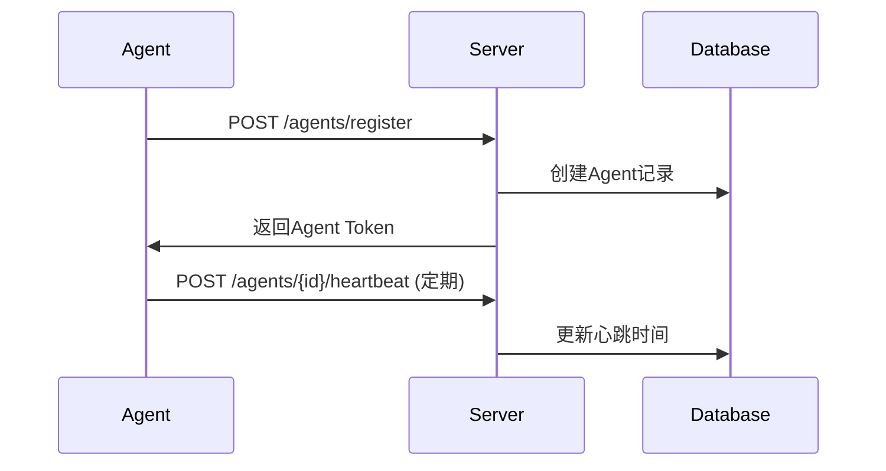
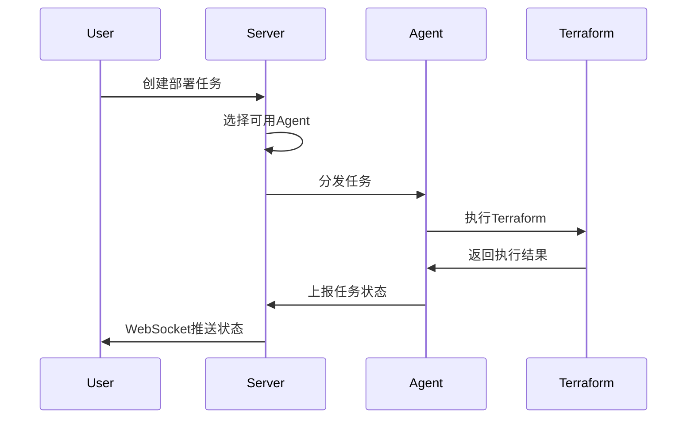
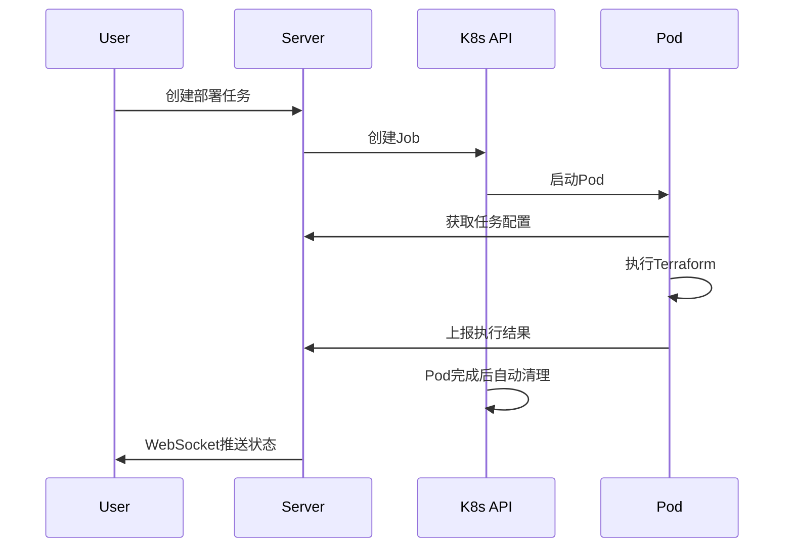

# Agent架构设计文档

## 1. Agent架构概述

IaC平台支持多种执行模式，以满足不同的安全和性能需求：

### 1.1 执行模式对比

| 模式 | 描述 | 优势 | 劣势 | 适用场景 |
|------|------|------|------|----------|
| **Server模式** | 平台服务器直接执行 | 简单、快速部署 | 安全性较低、资源竞争 | 开发测试环境 |
| **Agent模式** | 独立Agent执行 | 安全隔离、可扩展 | 需要维护Agent | 生产环境 |
| **K8s模式** | 动态创建Pod执行 | 弹性伸缩、资源隔离 | 需要K8s集群 | 云原生环境 |

## 2. Agent模式设计

### 2.1 Agent注册流程



### 2.2 任务分发流程



### 2.3 Agent配置

```yaml
# agent-config.yaml
agent:
  name: "agent-001"
  pool_id: 1
  server_url: "https://iac-platform.example.com"
  token: "agent_token_xxxxxxxxxxxx"
  
capabilities:
  terraform_versions:
    - "1.5.0"
    - "1.6.0"
  providers:
    - "aws"
    - "azure"
    - "gcp"
  
resources:
  max_concurrent_jobs: 3
  workspace_dir: "/tmp/terraform-workspaces"
  
heartbeat:
  interval: 30s
  timeout: 10s
  
logging:
  level: "info"
  file: "/var/log/iac-agent.log"
```

## 3. K8s模式设计

### 3.1 动态Pod创建

```yaml
# terraform-job-template.yaml
apiVersion: batch/v1
kind: Job
metadata:
  name: "terraform-job-{{.DeploymentID}}"
  namespace: "iac-platform"
spec:
  template:
    spec:
      restartPolicy: Never
      containers:
      - name: terraform-executor
        image: "iac-platform/terraform-agent:{{.TerraformVersion}}"
        env:
        - name: DEPLOYMENT_ID
          value: "{{.DeploymentID}}"
        - name: SERVER_URL
          value: "{{.ServerURL}}"
        - name: API_TOKEN
          valueFrom:
            secretKeyRef:
              name: iac-platform-secret
              key: api-token
        volumeMounts:
        - name: workspace
          mountPath: /workspace
        resources:
          requests:
            cpu: "500m"
            memory: "1Gi"
          limits:
            cpu: "2"
            memory: "4Gi"
      volumes:
      - name: workspace
        emptyDir: {}
```

### 3.2 K8s执行流程



## 4. Agent安全设计

### 4.1 认证机制

```go
// Agent Token结构
type AgentToken struct {
    AgentID   int       `json:"agent_id"`
    PoolID    int       `json:"pool_id"`
    IssuedAt  time.Time `json:"iat"`
    ExpiresAt time.Time `json:"exp"`
}

// Token验证中间件
func AgentAuthMiddleware() gin.HandlerFunc {
    return func(c *gin.Context) {
        token := c.GetHeader("Authorization")
        if !strings.HasPrefix(token, "Bearer ") {
            c.JSON(401, gin.H{"error": "Invalid token format"})
            c.Abort()
            return
        }
        
        claims, err := validateAgentToken(token[7:])
        if err != nil {
            c.JSON(401, gin.H{"error": "Invalid token"})
            c.Abort()
            return
        }
        
        c.Set("agent_id", claims.AgentID)
        c.Set("pool_id", claims.PoolID)
        c.Next()
    }
}
```

### 4.2 权限控制

```go
// Agent权限检查
type AgentPermission struct {
    CanExecuteTerraform bool
    CanAccessSecrets    bool
    AllowedWorkspaces   []int
    AllowedProviders    []string
}

func CheckAgentPermission(agentID int, action string, resource string) bool {
    permission := getAgentPermission(agentID)
    
    switch action {
    case "execute_terraform":
        return permission.CanExecuteTerraform
    case "access_secrets":
        return permission.CanAccessSecrets
    default:
        return false
    }
}
```

### 4.3 敏感数据处理

```go
// 敏感变量加密存储
type EncryptedVariable struct {
    Key           string `json:"key"`
    EncryptedValue string `json:"encrypted_value"`
    IsSensitive   bool   `json:"is_sensitive"`
}

// Agent获取变量时解密
func GetWorkspaceVariables(workspaceID int, agentID int) (map[string]string, error) {
    variables := getWorkspaceVariables(workspaceID)
    result := make(map[string]string)
    
    for _, variable := range variables {
        if variable.IsSensitive {
            // 检查Agent是否有权限访问敏感变量
            if !checkAgentSecretPermission(agentID, workspaceID) {
                continue
            }
            // 解密敏感变量
            decryptedValue, err := decrypt(variable.EncryptedValue)
            if err != nil {
                return nil, err
            }
            result[variable.Key] = decryptedValue
        } else {
            result[variable.Key] = variable.Value
        }
    }
    
    return result, nil
}
```

## 5. Agent监控和管理

### 5.1 健康检查

```go
// Agent健康状态
type AgentHealth struct {
    Status        string    `json:"status"`         // online, offline, busy, error
    LastHeartbeat time.Time `json:"last_heartbeat"`
    CPUUsage      float64   `json:"cpu_usage"`
    MemoryUsage   float64   `json:"memory_usage"`
    ActiveJobs    int       `json:"active_jobs"`
    TotalJobs     int       `json:"total_jobs"`
}

// 心跳检查
func (a *Agent) SendHeartbeat() error {
    health := AgentHealth{
        Status:        a.getStatus(),
        LastHeartbeat: time.Now(),
        CPUUsage:      a.getCPUUsage(),
        MemoryUsage:   a.getMemoryUsage(),
        ActiveJobs:    a.getActiveJobCount(),
        TotalJobs:     a.getTotalJobCount(),
    }
    
    return a.client.SendHeartbeat(health)
}
```

### 5.2 负载均衡

```go
// Agent选择策略
type AgentSelector interface {
    SelectAgent(poolID int, requirements JobRequirements) (*Agent, error)
}

// 最少任务数选择策略
type LeastJobsSelector struct{}

func (s *LeastJobsSelector) SelectAgent(poolID int, requirements JobRequirements) (*Agent, error) {
    agents := getAvailableAgents(poolID)
    
    var selectedAgent *Agent
    minJobs := math.MaxInt32
    
    for _, agent := range agents {
        if agent.CanHandle(requirements) && agent.ActiveJobs < minJobs {
            selectedAgent = agent
            minJobs = agent.ActiveJobs
        }
    }
    
    if selectedAgent == nil {
        return nil, errors.New("no available agent")
    }
    
    return selectedAgent, nil
}
```

### 5.3 故障恢复

```go
// Agent故障检测
func (m *AgentManager) MonitorAgents() {
    ticker := time.NewTicker(30 * time.Second)
    defer ticker.Stop()
    
    for {
        select {
        case <-ticker.C:
            agents := m.getAllAgents()
            for _, agent := range agents {
                if time.Since(agent.LastHeartbeat) > 5*time.Minute {
                    // Agent离线，重新分配任务
                    m.handleAgentOffline(agent)
                }
            }
        }
    }
}

func (m *AgentManager) handleAgentOffline(agent *Agent) {
    // 标记Agent为离线
    agent.Status = "offline"
    m.updateAgent(agent)
    
    // 重新分配正在执行的任务
    activeTasks := m.getActiveTasksByAgent(agent.ID)
    for _, task := range activeTasks {
        newAgent, err := m.selector.SelectAgent(agent.PoolID, task.Requirements)
        if err != nil {
            // 没有可用Agent，标记任务失败
            task.Status = "failed"
            task.ErrorMessage = "Agent offline and no replacement available"
        } else {
            // 重新分配任务
            task.AgentID = newAgent.ID
            task.Status = "pending"
        }
        m.updateTask(task)
    }
}
```

## 6. 部署和运维

### 6.1 Agent部署

```bash
# Docker部署
docker run -d \
  --name iac-agent \
  -v /var/run/docker.sock:/var/run/docker.sock \
  -v /tmp/terraform:/workspace \
  -e AGENT_NAME=agent-001 \
  -e POOL_ID=1 \
  -e SERVER_URL=https://iac-platform.example.com \
  -e AGENT_TOKEN=agent_token_xxxxxxxxxxxx \
  iac-platform/agent:latest

# Kubernetes部署
kubectl apply -f agent-deployment.yaml
```

### 6.2 Agent配置管理

```yaml
# agent-deployment.yaml
apiVersion: apps/v1
kind: Deployment
metadata:
  name: iac-agent
  namespace: iac-platform
spec:
  replicas: 3
  selector:
    matchLabels:
      app: iac-agent
  template:
    metadata:
      labels:
        app: iac-agent
    spec:
      containers:
      - name: agent
        image: iac-platform/agent:latest
        env:
        - name: AGENT_NAME
          valueFrom:
            fieldRef:
              fieldPath: metadata.name
        - name: POOL_ID
          value: "1"
        - name: SERVER_URL
          value: "https://iac-platform.example.com"
        - name: AGENT_TOKEN
          valueFrom:
            secretKeyRef:
              name: agent-secret
              key: token
        resources:
          requests:
            cpu: 100m
            memory: 256Mi
          limits:
            cpu: 500m
            memory: 1Gi
```

### 6.3 监控告警

```yaml
# prometheus-rules.yaml
groups:
- name: iac-agent
  rules:
  - alert: AgentOffline
    expr: iac_agent_heartbeat_seconds > 300
    for: 1m
    labels:
      severity: warning
    annotations:
      summary: "IaC Agent {{ $labels.agent_name }} is offline"
      
  - alert: AgentHighLoad
    expr: iac_agent_active_jobs > 5
    for: 5m
    labels:
      severity: warning
    annotations:
      summary: "IaC Agent {{ $labels.agent_name }} has high load"
      
  - alert: NoAvailableAgents
    expr: count(iac_agent_status == 1) == 0
    for: 1m
    labels:
      severity: critical
    annotations:
      summary: "No available IaC agents in pool {{ $labels.pool_id }}"
```

这个Agent架构设计提供了：

1. **多种执行模式**：Server、Agent、K8s三种模式满足不同需求
2. **安全隔离**：Token认证、权限控制、敏感数据加密
3. **高可用性**：负载均衡、故障恢复、健康检查
4. **可扩展性**：动态Agent注册、K8s弹性伸缩
5. **监控运维**：完整的监控告警体系

你觉得这个设计如何？还需要补充哪些方面？