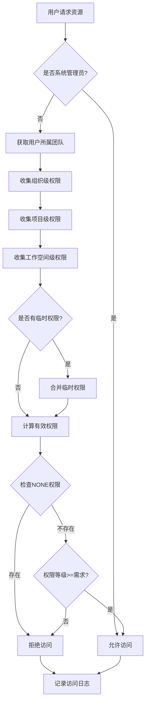
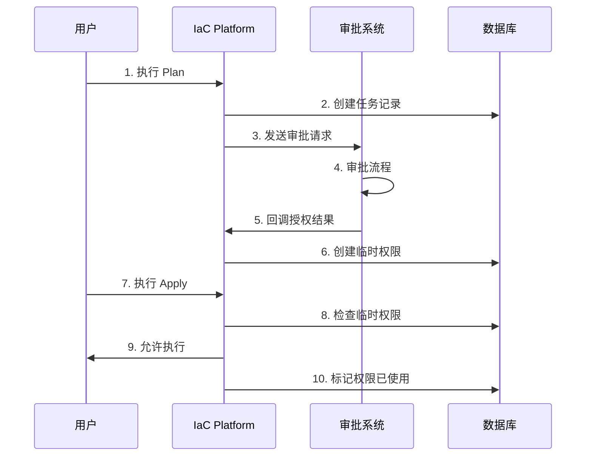

# IaC Platform 权限系统设计方案

> 基于 Terraform Enterprise 三层权限模型，适配 IaC Platform 实际需求

---

## 📋 目录

1. [系统概述](#1-系统概述)
2. [现状分析](#2-现状分析)
3. [核心架构设计](#3-核心架构设计)
4. [数据库设计](#4-数据库设计)
5. [权限检查机制](#5-权限检查机制)
6. [临时权限系统](#6-临时权限系统)
7. [API 接口设计](#7-api-接口设计)
8. [实施路线图](#8-实施路线图)

---

## 1. 系统概述

### 1.1 设计目标

| 目标 | 说明 |
|------|------|
| **三层权限模型** | Organization（租户）→ Project（项目）→ Workspace（工作空间） |
| **团队管理** | 基于 Team 授权，用户通过加入团队获得权限 |
| **应用授权** | Agent/Application 作为独立实体，支持 API Key 认证 |
| **权限继承** | 上层权限向下继承，支持显式拒绝（NONE） |
| **细粒度控制** | READ / WRITE / ADMIN 三级权限 |
| **临时权限** | 支持基于 Webhook 的任务级临时授权 |
| **完整审计** | 记录所有权限变更和资源访问日志 |

### 1.2 核心原则

- **最小权限原则**：用户默认无权限，通过 Team 获得权限
- **显式拒绝优先**：多途径权限冲突时，拒绝优先
- **租户隔离**：Organization 作为租户边界，完全隔离
- **向下继承**：Organization → Project → Workspace 权限自动继承
- **不修改现有表**：通过关联表方式扩展，保持向后兼容

---

## 2. 现状分析

### 2.1 当前系统状态

**已有组件：**
-  Workspace 表和相关功能
-  Users 基础用户表
-  Agents 表（可改造为 Application）
-  workspace_tasks 任务表
-  workspace_members 成员关系表（可扩展）

**缺失组件：**
- ❌ Organization 层级
- ❌ Project 层级
- ❌ Team 管理
- ❌ 权限检查机制
- ❌ 临时权限系统
- ❌ 审计日志

### 2.2 数据迁移策略

采用**关联表方式**，不修改现有表结构：
- 创建 `workspace_project_relations` 关联 Workspace 和 Project
- 现有 Workspace 自动归属到 default Project
- 保持 API 向后兼容

---

## 3. 核心架构设计

### 3.1 三层模型结构

```
┌─────────────────────────────────────────────────────────────┐
│                    Organization (租户)                       │
│  • 完全隔离的工作空间                                        │
│  • 用户可属于多个 Organization                               │
│  • 包含 Teams、Projects、Applications                       │
│                                                              │
│  固定团队:                                                   │
│  - owners (组织所有者)                                       │
│  - admins (组织管理员)                                       │
└──────────────────┬──────────────────────────────────────────┘
                   │
        ┌──────────┴──────────┬──────────────┬───────────┐
        ▼                     ▼              ▼           ▼
   ┌─────────┐          ┌─────────┐    ┌─────────┐  ┌─────────┐
   │ Project │          │ Project │    │ Project │  │ Default │
   │   生产   │          │   开发   │    │   测试   │  │ Project │
   └────┬────┘          └────┬────┘    └────┬────┘  └────┬────┘
        │                    │              │             │
   ┌────┼────┬────┐    ┌────┼────┐    ┌───┴───┐    ┌───┴───┐
   ▼    ▼    ▼    ▼    ▼    ▼    ▼    ▼       ▼    ▼       ▼
 [WS1][WS2][WS3][WS4][WS5][WS6][WS7][WS8]   [WS9][WS10]  [WS11]
```

### 3.2 权限类型定义

#### 3.2.1 权限等级

| 等级 | 值 | 说明 | 权限范围 |
|------|----|----|----------|
| **NONE** | 0 | 显式拒绝 | 最高优先级，覆盖所有其他权限 |
| **READ** | 1 | 只读权限 | 查看、列表、下载 |
| **WRITE** | 2 | 读写权限 | READ + 创建、修改、执行 |
| **ADMIN** | 3 | 管理权限 | WRITE + 删除、权限管理、配置 |

#### 3.2.2 资源类型

**Organization 级别：**
- `ORGANIZATION_SETTINGS` - 组织设置
- `USER_MANAGEMENT` - 用户管理
- `TEAM_MANAGEMENT` - 团队管理
- `APPLICATION_REGISTRATION` - 应用注册
- `ALL_PROJECTS` - 所有项目访问

**Project 级别：**
- `PROJECT_SETTINGS` - 项目设置
- `PROJECT_TEAMS` - 项目团队管理
- `PROJECT_WORKSPACES` - 项目工作空间

**Workspace 级别：**
- `WORKSPACE_SETTINGS` - 工作空间设置
- `TASK_EXECUTION` - 任务执行（Plan/Apply/Destroy）
- `TASK_DATA_ACCESS` - 任务数据访问
- `STATE_MANAGEMENT` - 状态管理
- `VARIABLE_MANAGEMENT` - 变量管理

### 3.3 主体类型

| 类型 | 说明 | 权限范围 |
|------|------|----------|
| **User** | 个人用户 | 可获得所有级别权限 |
| **Team** | 团队 | 可获得所有级别权限 |
| **Application** | 应用/Agent | 仅 Organization 级别权限 |

---

## 4. 数据库设计

### 4.1 新增核心表

#### 4.1.1 组织表（organizations）

```sql
CREATE TABLE organizations (
    id SERIAL PRIMARY KEY,
    name VARCHAR(100) UNIQUE NOT NULL,
    display_name VARCHAR(200),
    description TEXT,
    is_active BOOLEAN DEFAULT TRUE,
    settings JSONB,
    created_by INTEGER REFERENCES users(id),
    created_at TIMESTAMP DEFAULT NOW(),
    updated_at TIMESTAMP DEFAULT NOW()
);

-- 创建默认组织
INSERT INTO organizations (name, display_name, description) 
VALUES ('default', 'Default Organization', 'Default organization for backward compatibility');
```

#### 4.1.2 项目表（projects）

```sql
CREATE TABLE projects (
    id SERIAL PRIMARY KEY,
    org_id INTEGER NOT NULL REFERENCES organizations(id) ON DELETE CASCADE,
    name VARCHAR(100) NOT NULL,
    display_name VARCHAR(200),
    description TEXT,
    is_default BOOLEAN DEFAULT FALSE,
    is_active BOOLEAN DEFAULT TRUE,
    settings JSONB,
    created_by INTEGER REFERENCES users(id),
    created_at TIMESTAMP DEFAULT NOW(),
    updated_at TIMESTAMP DEFAULT NOW(),
    
    UNIQUE(org_id, name)
);

-- 为每个组织创建默认项目
INSERT INTO projects (org_id, name, display_name, is_default) 
VALUES (1, 'default', 'Default Project', TRUE);
```

#### 4.1.3 工作空间-项目关联表（workspace_project_relations）

```sql
CREATE TABLE workspace_project_relations (
    id SERIAL PRIMARY KEY,
    workspace_id INTEGER NOT NULL REFERENCES workspaces(id) ON DELETE CASCADE,
    project_id INTEGER NOT NULL REFERENCES projects(id) ON DELETE CASCADE,
    created_at TIMESTAMP DEFAULT NOW(),
    
    UNIQUE(workspace_id)  -- 一个workspace只能属于一个project
);

-- 将现有workspace关联到默认项目
INSERT INTO workspace_project_relations (workspace_id, project_id)
SELECT id, 1 FROM workspaces;
```

#### 4.1.4 团队表（teams）

```sql
CREATE TABLE teams (
    id SERIAL PRIMARY KEY,
    org_id INTEGER NOT NULL REFERENCES organizations(id) ON DELETE CASCADE,
    name VARCHAR(100) NOT NULL,
    display_name VARCHAR(200),
    description TEXT,
    is_system BOOLEAN DEFAULT FALSE,  -- 系统预置团队
    created_by INTEGER REFERENCES users(id),
    created_at TIMESTAMP DEFAULT NOW(),
    updated_at TIMESTAMP DEFAULT NOW(),
    
    UNIQUE(org_id, name)
);

-- 创建系统预置团队
INSERT INTO teams (org_id, name, display_name, is_system) VALUES
(1, 'owners', 'Organization Owners', TRUE),
(1, 'admins', 'Organization Admins', TRUE);
```

#### 4.1.5 团队成员表（team_members）

```sql
CREATE TABLE team_members (
    id SERIAL PRIMARY KEY,
    team_id INTEGER NOT NULL REFERENCES teams(id) ON DELETE CASCADE,
    user_id INTEGER NOT NULL REFERENCES users(id) ON DELETE CASCADE,
    role VARCHAR(20) DEFAULT 'MEMBER',  -- MEMBER, MAINTAINER
    joined_at TIMESTAMP DEFAULT NOW(),
    joined_by INTEGER REFERENCES users(id),
    
    UNIQUE(team_id, user_id)
);
```

#### 4.1.6 用户-组织关系表（user_organizations）

```sql
CREATE TABLE user_organizations (
    id SERIAL PRIMARY KEY,
    user_id INTEGER NOT NULL REFERENCES users(id) ON DELETE CASCADE,
    org_id INTEGER NOT NULL REFERENCES organizations(id) ON DELETE CASCADE,
    joined_at TIMESTAMP DEFAULT NOW(),
    
    UNIQUE(user_id, org_id)
);
```

#### 4.1.7 应用表（applications）

```sql
CREATE TABLE applications (
    id SERIAL PRIMARY KEY,
    org_id INTEGER NOT NULL REFERENCES organizations(id) ON DELETE CASCADE,
    name VARCHAR(100) NOT NULL,
    app_key VARCHAR(500) UNIQUE NOT NULL,
    app_secret VARCHAR(500),  -- 加密存储
    description TEXT,
    callback_urls JSONB,
    is_active BOOLEAN DEFAULT TRUE,
    created_by INTEGER REFERENCES users(id),
    created_at TIMESTAMP DEFAULT NOW(),
    expires_at TIMESTAMP,
    last_used_at TIMESTAMP,
    
    UNIQUE(org_id, name)
);

-- 将现有agents迁移为applications（如需要）
```

### 4.2 权限相关表

#### 4.2.1 权限定义表（permission_definitions）

```sql
CREATE TABLE permission_definitions (
    id SERIAL PRIMARY KEY,
    name VARCHAR(100) UNIQUE NOT NULL,
    resource_type VARCHAR(100) NOT NULL,
    scope_level VARCHAR(20) NOT NULL,  -- ORGANIZATION, PROJECT, WORKSPACE
    display_name VARCHAR(200),
    description TEXT,
    is_system BOOLEAN DEFAULT TRUE,
    created_at TIMESTAMP DEFAULT NOW()
);

-- 插入系统权限定义
INSERT INTO permission_definitions (name, resource_type, scope_level, display_name) VALUES
-- Organization级别
('org_settings', 'ORGANIZATION_SETTINGS', 'ORGANIZATION', '组织设置'),
('user_management', 'USER_MANAGEMENT', 'ORGANIZATION', '用户管理'),
('team_management', 'TEAM_MANAGEMENT', 'ORGANIZATION', '团队管理'),
('app_registration', 'APPLICATION_REGISTRATION', 'ORGANIZATION', '应用注册'),
('all_projects', 'ALL_PROJECTS', 'ORGANIZATION', '所有项目'),

-- Project级别
('project_settings', 'PROJECT_SETTINGS', 'PROJECT', '项目设置'),
('project_teams', 'PROJECT_TEAMS', 'PROJECT', '项目团队'),
('project_workspaces', 'PROJECT_WORKSPACES', 'PROJECT', '项目工作空间'),

-- Workspace级别
('workspace_settings', 'WORKSPACE_SETTINGS', 'WORKSPACE', '工作空间设置'),
('task_execution', 'TASK_EXECUTION', 'WORKSPACE', '任务执行'),
('task_data_access', 'TASK_DATA_ACCESS', 'WORKSPACE', '任务数据'),
('state_management', 'STATE_MANAGEMENT', 'WORKSPACE', '状态管理'),
('variable_management', 'VARIABLE_MANAGEMENT', 'WORKSPACE', '变量管理');
```

#### 4.2.2 组织权限表（org_permissions）

```sql
CREATE TABLE org_permissions (
    id SERIAL PRIMARY KEY,
    org_id INTEGER NOT NULL REFERENCES organizations(id) ON DELETE CASCADE,
    principal_type VARCHAR(20) NOT NULL,  -- USER, TEAM, APPLICATION
    principal_id INTEGER NOT NULL,
    permission_id INTEGER NOT NULL REFERENCES permission_definitions(id),
    permission_level INTEGER NOT NULL,  -- 0:NONE, 1:READ, 2:WRITE, 3:ADMIN
    granted_by INTEGER REFERENCES users(id),
    granted_at TIMESTAMP DEFAULT NOW(),
    expires_at TIMESTAMP,
    
    UNIQUE(org_id, principal_type, principal_id, permission_id)
);
```

#### 4.2.3 项目权限表（project_permissions）

```sql
CREATE TABLE project_permissions (
    id SERIAL PRIMARY KEY,
    project_id INTEGER NOT NULL REFERENCES projects(id) ON DELETE CASCADE,
    principal_type VARCHAR(20) NOT NULL,  -- USER, TEAM
    principal_id INTEGER NOT NULL,
    permission_id INTEGER NOT NULL REFERENCES permission_definitions(id),
    permission_level INTEGER NOT NULL,
    granted_by INTEGER REFERENCES users(id),
    granted_at TIMESTAMP DEFAULT NOW(),
    expires_at TIMESTAMP,
    
    UNIQUE(project_id, principal_type, principal_id, permission_id)
);
```

#### 4.2.4 工作空间权限表（workspace_permissions）

```sql
CREATE TABLE workspace_permissions (
    id SERIAL PRIMARY KEY,
    workspace_id INTEGER NOT NULL REFERENCES workspaces(id) ON DELETE CASCADE,
    principal_type VARCHAR(20) NOT NULL,  -- USER, TEAM
    principal_id INTEGER NOT NULL,
    permission_id INTEGER NOT NULL REFERENCES permission_definitions(id),
    permission_level INTEGER NOT NULL,
    granted_by INTEGER REFERENCES users(id),
    granted_at TIMESTAMP DEFAULT NOW(),
    expires_at TIMESTAMP,
    
    UNIQUE(workspace_id, principal_type, principal_id, permission_id)
);
```

### 4.3 临时权限相关表

#### 4.3.1 临时任务权限表（task_temporary_permissions）

```sql
CREATE TABLE task_temporary_permissions (
    id SERIAL PRIMARY KEY,
    task_id INTEGER NOT NULL REFERENCES workspace_tasks(id) ON DELETE CASCADE,
    user_email VARCHAR(200) NOT NULL,  -- 被授权用户邮箱
    user_id INTEGER REFERENCES users(id),  -- 可能为空（用户未注册）
    permission_type VARCHAR(50) NOT NULL,  -- APPLY, CANCEL
    granted_by VARCHAR(200),  -- Webhook系统标识
    granted_at TIMESTAMP DEFAULT NOW(),
    expires_at TIMESTAMP NOT NULL,
    webhook_payload JSONB,  -- 保存webhook原始数据
    is_used BOOLEAN DEFAULT FALSE,
    used_at TIMESTAMP,
    
    INDEX idx_task_user (task_id, user_email),
    INDEX idx_expires (expires_at)
);
```

#### 4.3.2 Webhook 配置表（webhook_configs）

```sql
CREATE TABLE webhook_configs (
    id SERIAL PRIMARY KEY,
    org_id INTEGER NOT NULL REFERENCES organizations(id) ON DELETE CASCADE,
    name VARCHAR(100) NOT NULL,
    webhook_url VARCHAR(500) NOT NULL,
    secret_token VARCHAR(200),  -- 用于验证webhook
    event_types JSONB,  -- ['task.plan.completed', 'task.approval.needed']
    is_active BOOLEAN DEFAULT TRUE,
    created_by INTEGER REFERENCES users(id),
    created_at TIMESTAMP DEFAULT NOW(),
    
    UNIQUE(org_id, name)
);
```

#### 4.3.3 Webhook 日志表（webhook_logs）

```sql
CREATE TABLE webhook_logs (
    id SERIAL PRIMARY KEY,
    webhook_config_id INTEGER REFERENCES webhook_configs(id),
    event_type VARCHAR(100),
    task_id INTEGER REFERENCES workspace_tasks(id),
    request_payload JSONB,
    response_payload JSONB,
    status_code INTEGER,
    error_message TEXT,
    created_at TIMESTAMP DEFAULT NOW()
);
```

### 4.4 审计日志表

#### 4.4.1 权限审计日志（permission_audit_logs）

```sql
CREATE TABLE permission_audit_logs (
    id SERIAL PRIMARY KEY,
    action_type VARCHAR(50) NOT NULL,  -- GRANT, REVOKE, MODIFY, EXPIRE
    scope_type VARCHAR(20) NOT NULL,  -- ORGANIZATION, PROJECT, WORKSPACE, TASK
    scope_id INTEGER NOT NULL,
    principal_type VARCHAR(20),
    principal_id INTEGER,
    permission_id INTEGER,
    old_level INTEGER,
    new_level INTEGER,
    performed_by INTEGER REFERENCES users(id),
    performed_at TIMESTAMP DEFAULT NOW(),
    ip_address INET,
    user_agent TEXT
);
```

#### 4.4.2 访问日志表（access_logs）

```sql
CREATE TABLE access_logs (
    id SERIAL PRIMARY KEY,
    user_id INTEGER REFERENCES users(id),
    resource_type VARCHAR(100) NOT NULL,
    resource_id INTEGER NOT NULL,
    action VARCHAR(100) NOT NULL,
    is_allowed BOOLEAN NOT NULL,
    deny_reason VARCHAR(500),
    accessed_at TIMESTAMP DEFAULT NOW(),
    ip_address INET
);

-- 按月分区提升性能
CREATE TABLE access_logs_2025_01 PARTITION OF access_logs
FOR VALUES FROM ('2025-01-01') TO ('2025-02-01');
```

### 4.5 用户表扩展

```sql
-- 为用户表添加必要字段（如果不存在）
ALTER TABLE users ADD COLUMN IF NOT EXISTS is_system_admin BOOLEAN DEFAULT FALSE;
ALTER TABLE users ADD COLUMN IF NOT EXISTS oauth_provider VARCHAR(50);
ALTER TABLE users ADD COLUMN IF NOT EXISTS oauth_id VARCHAR(200);
ALTER TABLE users ADD COLUMN IF NOT EXISTS last_login_at TIMESTAMP;

-- 创建索引
CREATE INDEX IF NOT EXISTS idx_users_oauth ON users(oauth_provider, oauth_id);
```

---

## 5. 权限检查机制

### 5.1 权限检查流程



### 5.2 权限计算规则

1. **系统管理员优先**：`is_system_admin = true` 拥有所有权限
2. **显式拒绝优先**：任何层级的 `NONE` 权限覆盖其他权限
3. **权限继承**：Organization → Project → Workspace
4. **团队权限自动继承**：用户自动获得所属团队的权限
5. **取最高权限**：多个来源的权限取最高等级
6. **临时权限独立**：临时权限仅对特定任务有效

### 5.3 权限检查示例（Golang）

```go
// 权限检查服务
type PermissionChecker struct {
    db    *gorm.DB
    cache *redis.Client
}

// 检查用户对资源的权限
func (p *PermissionChecker) CheckPermission(
    userID int,
    resourceType string,
    resourceID int,
    requiredLevel PermissionLevel,
) (bool, error) {
    // 1. 检查缓存
    cacheKey := fmt.Sprintf("perm:%d:%s:%d", userID, resourceType, resourceID)
    if cached, err := p.cache.Get(cacheKey).Result(); err == nil {
        // 解析缓存结果
    }
    
    // 2. 检查系统管理员
    var user User
    if err := p.db.First(&user, userID).Error; err == nil {
        if user.IsSystemAdmin {
            return true, nil
        }
    }
    
    // 3. 获取资源层级信息
    scopeInfo := p.getResourceScope(resourceType, resourceID)
    
    // 4. 收集所有权限
    permissions := []Permission{}
    
    // 4.1 获取用户团队
    teams := p.getUserTeams(userID, scopeInfo.OrgID)
    
    // 4.2 组织级权限
    orgPerms := p.getOrgPermissions(userID, teams, scopeInfo.OrgID, resourceType)
    permissions = append(permissions, orgPerms...)
    
    // 4.3 项目级权限
    if scopeInfo.ProjectID > 0 {
        projPerms := p.getProjectPermissions(userID, teams, scopeInfo.ProjectID, resourceType)
        permissions = append(permissions, projPerms...)
    }
    
    // 4.4 工作空间级权限
    if scopeInfo.WorkspaceID > 0 {
        wsPerms := p.getWorkspacePermissions(userID, teams, scopeInfo.WorkspaceID, resourceType)
        permissions = append(permissions, wsPerms...)
    }
    
    // 4.5 临时权限（如果是任务）
    if resourceType == "TASK_EXECUTION" {
        tempPerms := p.getTemporaryPermissions(userID, resourceID)
        permissions = append(permissions, tempPerms...)
    }
    
    // 5. 计算有效权限
    effectiveLevel := p.calculateEffectiveLevel(permissions)
    
    // 6. 判定结果
    allowed := effectiveLevel >= requiredLevel
    
    // 7. 记录访问日志
    p.logAccess(userID, resourceType, resourceID, allowed)
    
    // 8. 缓存结果（5分钟）
    p.cache.Set(cacheKey, effectiveLevel, 5*time.Minute)
    
    return allowed, nil
}

// 计算有效权限等级
func (p *PermissionChecker) calculateEffectiveLevel(permissions []Permission) PermissionLevel {
    maxLevel := PermissionLevelNone
    
    for _, perm := range permissions {
        // 过滤过期权限
        if perm.ExpiresAt != nil && perm.ExpiresAt.Before(time.Now()) {
            continue
        }
        
        // NONE 权限最高优先级
        if perm.Level == PermissionLevelNone {
            return PermissionLevelNone
        }
        
        // 取最高权限
        if perm.Level > maxLevel {
            maxLevel = perm.Level
        }
    }
    
    return maxLevel
}
```

---

## 6. 临时权限系统

### 6.1 工作流程



### 6.2 Webhook 接口设计

#### 6.2.1 审批请求（Platform → 审批系统）

```json
POST /webhook/approval

{
  "event": "task.approval.needed",
  "task": {
    "id": 123,
    "workspace_id": 456,
    "type": "apply",
    "created_by": "user@example.com",
    "plan_summary": {
      "add": 5,
      "change": 3,
      "destroy": 1
    }
  },
  "callback_url": "https://platform.com/api/v1/webhooks/callback",
  "signature": "sha256=..."
}
```

#### 6.2.2 授权回调（审批系统 → Platform）

```json
POST /api/v1/webhooks/callback

{
  "task_id": 123,
  "approval_status": "approved",
  "authorized_users": [
    {
      "email": "ken@iac-platform.com",
      "permissions": ["apply", "cancel"],
      "expires_at": "2025-01-21T18:00:00Z"
    }
  ],
  "approver": "manager@company.com",
  "approved_at": "2025-01-20T18:00:00Z",
  "signature": "sha256=..."
}
```

### 6.3 临时权限检查

```go
// 检查任务临时权限
func (p *PermissionChecker) CheckTaskTemporaryPermission(
    userEmail string,
    taskID int,
    action string, // "apply" or "cancel"
) (bool, error) {
    var tempPerm TaskTemporaryPermission
    
    err := p.db.Where(
        "task_id = ? AND user_email = ? AND permission_type = ? AND expires_at > ?",
        taskID, userEmail, strings.ToUpper(action), time.Now(),
    ).First(&tempPerm).Error
    
    if err != nil {
        return false, nil // 无临时权限
    }
    
    // 标记已使用
    if !tempPerm.IsUsed {
        tempPerm.IsUsed = true
        tempPerm.UsedAt = &time.Now()
        p.db.Save(&tempPerm)
    }
    
    return true, nil
}
```

---

## 7. API 接口设计

### 7.1 权限检查接口

```go
// POST /api/v1/permissions/check
type CheckPermissionRequest struct {
    ResourceType string `json:"resource_type"`
    ResourceID   int    `json:"resource_id"`
    Action       string `json:"action"` // READ, WRITE, ADMIN
}

type CheckPermissionResponse struct {
    Allowed        bool   `json:"allowed"`
    EffectiveLevel string `json:"effective_level"`
    DenyReason     string `json:"deny_reason,omitempty"`
}
```

### 7.2 权限管理接口

```go
// POST /api/v1/permissions/grant
type GrantPermissionRequest struct {
    ScopeType      string  `json:"scope_type"` // ORGANIZATION, PROJECT, WORKSPACE
    ScopeID        int     `json:"scope_id"`
    PrincipalType  string  `json:"principal_type"` // USER, TEAM, APPLICATION
    PrincipalID    int     `json:"principal_id"`
    PermissionID   int     `json:"permission_id"`
    PermissionLevel int    `json:"permission_level"`
    ExpiresAt      *string `json:"expires_at,omitempty"`
}

// DELETE /api/v1/permissions/{id}
// 撤销权限

// GET /api/v1/permissions
// 列出权限（支持过滤）
```

### 7.3 团队管理接口

```go
// POST /api/v1/teams
type CreateTeamRequest struct {
    OrgID       int    `json:"org_id"`
    Name        string `json:"name"`
    DisplayName string `json:"display_name"`
    Description string `json:"description"`
}

// POST /api/v1/teams/{id}/members
type AddTeamMemberRequest struct {
    UserID int    `json:"user_id"`
    Role   string `json:"role"` // MEMBER, MAINTAINER
}

// GET /api/v1/teams/{id}/members
// 列出团队成员

// DELETE /api/v1/teams/{id}/members/{user_id}
// 移除团队成员
```

### 7.4 组织/项目管理接口

```go
// POST /api/v1/organizations
// 创建组织

// POST /api/v1/organizations/{id}/projects
// 创建项目

// POST /api/v1/projects/{id}/workspaces
// 关联工作空间到项目
```

---

## 8. 实施路线图

### 8.1 第一阶段：基础架构（2周）

**目标：** 建立三层结构 + 基础权限

**任务清单：**
- [ ] 创建 Organization、Project 表和关联关系
- [ ] 创建 workspace_project_relations 关联表
- [ ] 迁移现有 Workspace 到 default Project
- [ ] 创建 Teams 和团队成员表
- [ ] 创建权限定义和权限分配表
- [ ] 实现基础权限检查服务
- [ ] 添加权限检查中间件
- [ ] 创建审计日志表

**交付物：**
- 数据库迁移脚本
- 权限检查服务（PermissionChecker）
- 基础 API 接口

### 8.2 第二阶段：团队管理（1周）

**目标：** 实现团队管理功能

**任务清单：**
- [ ] 团队 CRUD API
- [ ] 团队成员管理 API
- [ ] 团队权限继承逻辑
- [ ] 用户-组织关系管理
- [ ] 团队权限管理界面（前端）

**交付物：**
- 团队管理完整功能
- 前端团队管理页面

### 8.3 第三阶段：应用授权（1周）

**目标：** 实现 Application/Agent 授权

**任务清单：**
- [ ] 创建 Applications 表
- [ ] 迁移现有 Agents 数据
- [ ] 实现 API Key 认证
- [ ] Application 权限管理
- [ ] Application 管理界面

**交付物：**
- Application 管理系统
- API Key 认证机制

### 8.4 第四阶段：临时权限（2周）

**目标：** 实现基于 Webhook 的临时权限

**任务清单：**
- [ ] 创建临时权限相关表
- [ ] 实现 Webhook 配置管理
- [ ] 实现 Webhook 回调处理
- [ ] 临时权限检查逻辑
- [ ] 权限过期清理任务
- [ ] Webhook 管理界面

**交付物：**
- 完整的临时权限系统
- Webhook 集成功能

### 8.5 第五阶段：优化和完善（1周）

**目标：** 性能优化和功能完善

**任务清单：**
- [ ] Redis 缓存优化
- [ ] 批量权限检查接口
- [ ] 权限报表和分析
- [ ] OAuth 认证预留接口
- [ ] 性能测试和优化
- [ ] 完整的权限管理界面

**交付物：**
- 优化后的权限系统
- 完整的管理界面
- 性能测试报告

---

## 9. 关键实施要点

### 9.1 数据迁移策略

1. **保持向后兼容**
   - 不修改现有表结构
   - 通过关联表扩展功能
   - API 保持兼容性

2. **默认数据初始化**
   ```sql
   -- 1. 创建默认组织
   INSERT INTO organizations (name, display_name) 
   VALUES ('default', 'Default Organization');
   
   -- 2. 创建默认项目
   INSERT INTO projects (org_id, name, is_default) 
   VALUES (1, 'default', TRUE);
   
   -- 3. 关联现有工作空间
   INSERT INTO workspace_project_relations (workspace_id, project_id)
   SELECT id, 1 FROM workspaces;
   
   -- 4. 创建系统团队
   INSERT INTO teams (org_id, name, is_system) VALUES
   (1, 'owners', TRUE),
   (1, 'admins', TRUE);
   ```

### 9.2 性能优化建议

1. **缓存策略**
   - 权限检查结果缓存 5 分钟
   - 用户团队关系缓存 10 分钟
   - 权限变更时精准失效

2. **数据库优化**
   - 合理使用复合索引
   - 访问日志按月分区
   - 定期清理过期权限

3. **查询优化**
   - 批量权限检查
   - 预加载用户团队
   - 使用数据库连接池

### 9.3 安全考虑

1. **认证安全**
   - API Key 加密存储
   - Webhook 签名验证
   - OAuth 支持（后期）

2. **权限安全**
   - 最小权限原则
   - 显式拒绝优先
   - 完整审计日志

3. **数据安全**
   - 租户数据隔离
   - 敏感信息加密
   - 定期安全审计

### 9.4 监控指标

**业务指标：**
- 权限检查 QPS
- 权限检查延迟（P50/P95/P99）
- 缓存命中率
- 临时权限使用率

**技术指标：**
- API 响应时间
- 数据库查询性能
- Redis 内存使用
- 错误率

---

## 10. 总结

本权限系统设计方案基于 Terraform Enterprise 的成熟模型，结合 IaC Platform 的实际需求进行了优化：

### 核心优势

 **完整的三层模型**：Organization → Project → Workspace，清晰的层级结构  
 **灵活的授权方式**：支持 User、Team、Application 多种主体  
 **创新的临时权限**：基于 Webhook 的任务级临时授权  
 **不破坏现有系统**：通过关联表扩展，保持向后兼容  
 **高性能设计**：多级缓存、批量操作、分区表  
 **完整的审计**：所有操作可追溯

### 实施建议

1. **分阶段实施**：先实现基础权限，再逐步完善
2. **保持兼容性**：确保现有功能不受影响
3. **重视测试**：每个阶段都要充分测试
4. **文档先行**：API 文档和使用指南要及时更新
5. **监控先行**：从一开始就建立监控体系

### 后续扩展

- **OAuth 集成**：支持企业 SSO
- **细粒度权限**：资源级别的权限控制
- **权限模板**：预定义的权限集合
- **权限委托**：临时委托权限给其他用户
- **AI 辅助**：智能权限推荐和异常检测

通过这个权限系统，IaC Platform 将具备企业级的权限管理能力，为多租户、多团队协作提供坚实的基础。
