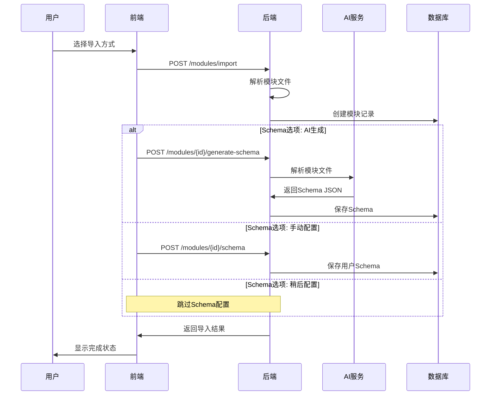

# 模块导入流程优化设计

## 🎯 设计目标

优化模块导入流程，提供更直观、用户友好的导入体验：
- 支持多种导入方式（URL/文件上传）
- 灵活的Schema配置选项（AI生成/手动配置/稍后配置）
- 清晰的步骤指引和用户反馈
- 简化的API设计和数据结构

## 🚀 优化后的导入流程

### 用户体验流程
```mermaid
graph TD
    A[点击"导入模块"] --> B[选择导入方式]
    B --> C{导入方式}
    C -->|Git仓库| D[输入仓库URL和分支]
    C -->|文件上传| E[选择ZIP文件]
    D --> F[填写模块基本信息]
    E --> F
    F --> G[选择Schema配置方式]
    G --> H{Schema选项}
    H -->|AI自动生成| I[AI解析生成Schema]
    H -->|手动配置| J[上传或编写Schema]
    H -->|稍后配置| K[跳过Schema配置]
    I --> L[预览并确认]
    J --> L
    K --> M[完成导入]
    L --> M
```

### 技术实现流程


## 📋 API设计优化

### 1. 模块导入API
```http
POST /api/v1/modules/import
Content-Type: multipart/form-data

# 请求体 (支持两种导入方式)
{
  "import_type": "url" | "upload",
  "name": "模块名称",
  "provider": "aws|azure|gcp",
  "description": "模块描述",
  "schema_option": "ai_generate|user_provided|skip",
  
  // URL导入时的字段
  "source_url": "https://github.com/...",
  "branch": "main",
  "path": "/",
  
  // 文件上传时的字段
  "module_file": <ZIP文件>,
  
  // 用户提供Schema时的字段
  "schema_data": { ... }
}
```

**响应格式**:
```json
{
  "code": 200,
  "message": "模块导入成功",
  "data": {
    "module": {
      "id": 1,
      "name": "s3-bucket",
      "provider": "aws",
      "import_type": "url",
      "sync_status": "completed"
    },
    "schema": {
      "id": 1,
      "status": "active",
      "ai_generated": true
    }
  }
}
```

### 2. Schema配置API
```http
# AI生成Schema
POST /api/v1/modules/{id}/generate-schema
{
  "ai_provider": "openai",
  "model": "gpt-4",
  "options": {
    "include_advanced": true,
    "generate_defaults": true,
    "use_template": true
  }
}

# 手动配置Schema
POST /api/v1/modules/{id}/schema
{
  "schema_data": { ... },
  "version": "1.0.0"
}

# 获取Schema预览
GET /api/v1/modules/{id}/schema-preview
```

## 🗄️ 数据库结构优化

### 简化的模块表
```sql
CREATE TABLE modules (
    id SERIAL PRIMARY KEY,
    name VARCHAR(100) NOT NULL,
    provider VARCHAR(50) NOT NULL,
    description TEXT,
    
    -- 导入方式和来源
    import_type VARCHAR(20) NOT NULL, -- 'url' or 'upload'
    source_url VARCHAR(500),          -- Git仓库URL (url导入时)
    branch VARCHAR(100),              -- Git分支
    path VARCHAR(200) DEFAULT '/',    -- 模块路径
    
    -- 模块文件内容
    module_files JSONB,               -- 存储模块文件内容
    sync_status VARCHAR(20) DEFAULT 'pending', -- pending, syncing, completed, failed
    
    -- 元数据
    created_by INTEGER REFERENCES users(id),
    created_at TIMESTAMP DEFAULT NOW(),
    updated_at TIMESTAMP DEFAULT NOW(),
    
    UNIQUE(name, provider)
);
```

### Schema表保持不变
```sql
CREATE TABLE schemas (
    id SERIAL PRIMARY KEY,
    module_id INTEGER REFERENCES modules(id),
    schema_data JSONB NOT NULL,
    version VARCHAR(20) DEFAULT '1.0.0',
    status VARCHAR(20) DEFAULT 'active',
    ai_generated BOOLEAN DEFAULT false,
    created_by INTEGER REFERENCES users(id),
    created_at TIMESTAMP DEFAULT NOW(),
    updated_at TIMESTAMP DEFAULT NOW()
);
```

## 🎨 前端组件设计

### 1. 模块导入向导
```typescript
const ModuleImportWizard: React.FC = () => {
  const [currentStep, setCurrentStep] = useState(1);
  const [importData, setImportData] = useState<ImportData>({});
  
  const steps = [
    { title: '选择导入方式', component: ImportMethodStep },
    { title: '配置模块信息', component: ModuleInfoStep },
    { title: 'Schema配置', component: SchemaConfigStep },
    { title: '完成导入', component: ImportCompleteStep }
  ];
  
  return (
    <div className="import-wizard">
      <StepIndicator current={currentStep} steps={steps} />
      <div className="step-content">
        {React.createElement(steps[currentStep - 1].component, {
          data: importData,
          onNext: handleNext,
          onPrev: handlePrev
        })}
      </div>
    </div>
  );
};
```

### 2. 导入方式选择
```typescript
const ImportMethodStep: React.FC<StepProps> = ({ onNext }) => {
  const [method, setMethod] = useState<'url' | 'upload'>('url');
  
  return (
    <div className="import-method">
      <h2>选择导入方式</h2>
      
      <div className="method-options">
        <div 
          className={`option ${method === 'url' ? 'selected' : ''}`}
          onClick={() => setMethod('url')}
        >
          <div className="icon">🌐</div>
          <h3>从Git仓库导入</h3>
          <p>从GitHub、GitLab等Git仓库导入Terraform模块</p>
          <ul>
            <li>支持公开和私有仓库</li>
            <li>自动同步更新</li>
            <li>版本管理</li>
          </ul>
        </div>
        
        <div 
          className={`option ${method === 'upload' ? 'selected' : ''}`}
          onClick={() => setMethod('upload')}
        >
          <div className="icon">📁</div>
          <h3>上传ZIP文件</h3>
          <p>上传包含Terraform模块的ZIP压缩包</p>
          <ul>
            <li>支持本地模块</li>
            <li>快速导入</li>
            <li>离线使用</li>
          </ul>
        </div>
      </div>
      
      {method === 'url' && <UrlImportForm onSubmit={onNext} />}
      {method === 'upload' && <FileUploadForm onSubmit={onNext} />}
    </div>
  );
};
```

### 3. Schema配置选择
```typescript
const SchemaConfigStep: React.FC<StepProps> = ({ moduleId, onNext }) => {
  const [option, setOption] = useState<'ai' | 'manual' | 'skip'>('ai');
  
  return (
    <div className="schema-config">
      <h2>配置表单Schema</h2>
      <p>Schema定义了用户填写表单时的字段和验证规则</p>
      
      <div className="config-options">
        <label className={`option ${option === 'ai' ? 'selected' : ''}`}>
          <input 
            type="radio" 
            value="ai" 
            checked={option === 'ai'}
            onChange={(e) => setOption(e.target.value as any)}
          />
          <div className="content">
            <div className="header">
              <span className="icon">🤖</span>
              <h3>AI自动生成 (推荐)</h3>
            </div>
            <p>系统将分析模块文件，自动生成表单Schema</p>
            <div className="features">
              <span className="feature">✓ 智能识别字段类型</span>
              <span className="feature">✓ 自动设置默认值</span>
              <span className="feature">✓ 生成字段描述</span>
            </div>
          </div>
        </label>
        
        <label className={`option ${option === 'manual' ? 'selected' : ''}`}>
          <input 
            type="radio" 
            value="manual" 
            checked={option === 'manual'}
            onChange={(e) => setOption(e.target.value as any)}
          />
          <div className="content">
            <div className="header">
              <span className="icon">✏️</span>
              <h3>手动配置</h3>
            </div>
            <p>上传或编写自定义Schema配置文件</p>
            <div className="features">
              <span className="feature">✓ 完全自定义</span>
              <span className="feature">✓ 精确控制</span>
              <span className="feature">✓ 复用现有配置</span>
            </div>
          </div>
        </label>
        
        <label className={`option ${option === 'skip' ? 'selected' : ''}`}>
          <input 
            type="radio" 
            value="skip" 
            checked={option === 'skip'}
            onChange={(e) => setOption(e.target.value as any)}
          />
          <div className="content">
            <div className="header">
              <span className="icon">⏭️</span>
              <h3>稍后配置</h3>
            </div>
            <p>先导入模块，稍后再配置Schema</p>
            <div className="features">
              <span className="feature">✓ 快速导入</span>
              <span className="feature">✓ 灵活配置</span>
              <span className="feature">✓ 分步完成</span>
            </div>
          </div>
        </label>
      </div>
      
      {option === 'ai' && <AIGenerateOptions onGenerate={handleAIGenerate} />}
      {option === 'manual' && <ManualSchemaEditor onSave={handleManualSave} />}
      {option === 'skip' && (
        <div className="skip-notice">
          <p>模块将被导入，但暂时无法使用表单功能。</p>
          <p>您可以稍后在模块详情页面配置Schema。</p>
        </div>
      )}
    </div>
  );
};
```

## 🔧 后端实现要点

### 1. 模块导入服务
```go
type ModuleImportService struct {
    db        *gorm.DB
    aiService *AIService
    vcsClient *VCSClient
}

func (s *ModuleImportService) ImportModule(req *ImportModuleRequest) (*ImportResult, error) {
    // 1. 创建模块记录
    module := &models.Module{
        Name:        req.Name,
        Provider:    req.Provider,
        Description: req.Description,
        ImportType:  req.ImportType,
        SourceURL:   req.SourceURL,
        Branch:      req.Branch,
        SyncStatus:  "pending",
    }
    
    if err := s.db.Create(module).Error; err != nil {
        return nil, err
    }
    
    // 2. 获取模块文件
    var moduleFiles map[string]string
    var err error
    
    switch req.ImportType {
    case "url":
        moduleFiles, err = s.vcsClient.FetchModuleFiles(req.SourceURL, req.Branch, req.Path)
    case "upload":
        moduleFiles, err = s.extractZipFiles(req.ModuleFile)
    }
    
    if err != nil {
        return nil, err
    }
    
    // 3. 更新模块文件
    module.ModuleFiles = moduleFiles
    module.SyncStatus = "completed"
    s.db.Save(module)
    
    // 4. 处理Schema配置
    var schema *models.Schema
    switch req.SchemaOption {
    case "ai_generate":
        schema, err = s.generateSchemaWithAI(module.ID, moduleFiles)
    case "user_provided":
        schema, err = s.createUserSchema(module.ID, req.SchemaData)
    case "skip":
        // 不创建Schema
    }
    
    return &ImportResult{
        Module: module,
        Schema: schema,
    }, nil
}
```

### 2. AI Schema生成
```go
func (s *ModuleImportService) generateSchemaWithAI(moduleID uint, moduleFiles map[string]string) (*models.Schema, error) {
    // 1. 准备AI提示词
    prompt := s.buildAIPrompt(moduleFiles)
    
    // 2. 调用AI服务
    schemaData, err := s.aiService.GenerateSchema(prompt)
    if err != nil {
        return nil, err
    }
    
    // 3. 验证Schema格式
    if err := s.validateSchema(schemaData); err != nil {
        return nil, err
    }
    
    // 4. 创建Schema记录
    schema := &models.Schema{
        ModuleID:     moduleID,
        SchemaData:   schemaData,
        Version:      "1.0.0",
        Status:       "active",
        AIGenerated:  true,
    }
    
    return schema, s.db.Create(schema).Error
}
```

## 📱 用户体验优化

### 1. 进度指示
- 清晰的步骤指示器
- 实时进度反馈
- 可返回上一步修改

### 2. 错误处理
- 友好的错误提示
- 具体的解决建议
- 支持重试操作

### 3. 预览功能
- 模块文件结构预览
- Schema配置预览
- 表单效果预览

### 4. 智能建议
- 根据文件内容自动建议模块名称
- 智能识别提供商类型
- 推荐合适的Schema模板

## 🎯 实现优先级

### Phase 1: 基础导入功能
1. 实现简化的模块导入API
2. 支持URL和文件上传两种方式
3. 基础的前端导入界面

### Phase 2: Schema配置
1. 集成AI Schema生成
2. 支持手动Schema配置
3. Schema预览和验证

### Phase 3: 用户体验优化
1. 完善导入向导界面
2. 添加进度指示和错误处理
3. 实现预览和智能建议功能

### Phase 4: 高级功能
1. 支持私有仓库访问
2. 批量导入功能
3. 模块模板系统

这个优化设计提供了更直观、灵活的模块导入体验，同时保持了技术实现的简洁性和可维护性。