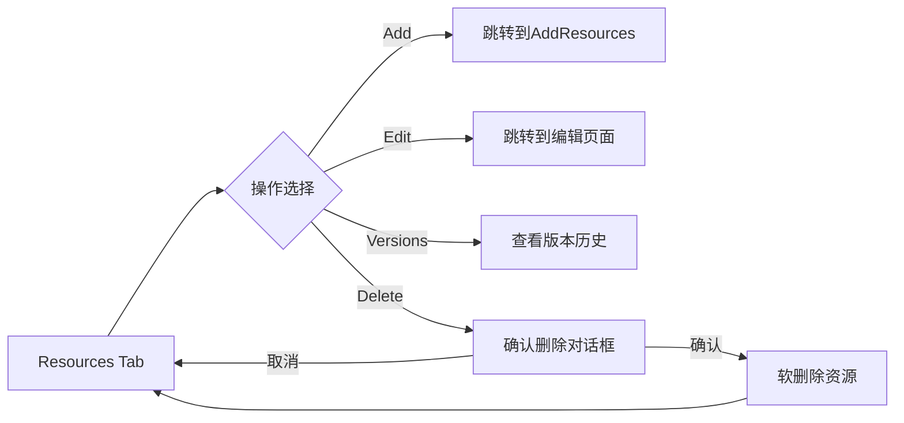
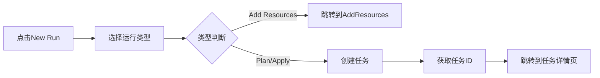

# Resources Management & New Run Optimization Implementation

> **实施日期**: 2025-10-12  
> **状态**:  已完成  
> **开发者**: AI Assistant

## 📋 实施概述

本次实施完成了两个主要优化：

1. **Resources管理页面** - 新增完整的资源管理功能
2. **New Run对话框优化** - 改进用户体验，直接跳转到任务详情页

## 🎯 需求背景

### 问题1: 缺少Resources管理页面
- 当前通过New Run可以新增资源
- Workspace里的资源不能查看、修改和删除
- 用户无法管理已创建的资源

### 问题2: New Run跳转逻辑不合理
- 当前任何支持New Run的页面都会跳转回Overview页面
- 用户需要手动导航到Runs标签页查看任务
- 无法直接查看新创建任务的详情

##  实施内容

### 1. Resources管理页面

#### 1.1 前端实现

**新增文件**:
- `frontend/src/pages/ResourcesTab.tsx` - Resources标签页组件
- `frontend/src/pages/ResourcesTab.module.css` - 样式文件

**功能特性**:
-  资源列表展示（表格形式）
-  搜索功能（按名称、类型、描述）
-  过滤功能（显示/隐藏已删除资源）
-  资源操作：
  - 编辑资源
  - 查看版本历史
  - 删除资源（软删除）
-  空状态提示
-  响应式设计

**数据字段**:
```typescript
interface Resource {
  id: number;
  workspace_id: number;
  resource_type: string;
  resource_name: string;
  resource_id: string;
  current_version: number;
  is_active: boolean;
  description: string;
  tf_code: any;
  variables: any;
  created_by: number;
  created_at: string;
  updated_at: string;
}
```

#### 1.2 集成到WorkspaceDetail

**修改文件**: `frontend/src/pages/WorkspaceDetail.tsx`

**变更内容**:
1. 导入ResourcesTab组件
2. 更新TabType类型定义，添加'resources'
3. 在导航菜单中添加Resources选项
4. 在renderTabContent中添加resources case

**导航位置**:
```
Overview
Runs
States
Resources  ← 新增
Variables
Health
Settings
```

#### 1.3 后端API

**已存在的API** (无需修改):
- `GET /api/v1/workspaces/:id/resources` - 获取资源列表
- `GET /api/v1/workspaces/:id/resources/:resource_id` - 获取资源详情
- `PUT /api/v1/workspaces/:id/resources/:resource_id` - 更新资源
- `DELETE /api/v1/workspaces/:id/resources/:resource_id` - 删除资源
- `GET /api/v1/workspaces/:id/resources/:resource_id/versions` - 获取版本历史

**Controller**: `backend/controllers/resource_controller.go`  
**Service**: `backend/services/resource_service.go`  
**Model**: `backend/internal/models/workspace_resource.go`

### 2. New Run对话框优化

#### 2.1 优化内容

**修改文件**: `frontend/src/components/NewRunDialog.tsx`

**变更前**:
```typescript
// 创建任务后跳转到Runs标签页
navigate(`/workspaces/${workspaceId}?tab=runs`);
```

**变更后**:
```typescript
// 获取创建的任务ID
const taskId = response.data?.task?.id || response.task?.id;

// 直接跳转到任务详情页
if (taskId) {
  navigate(`/workspaces/${workspaceId}/tasks/${taskId}`);
} else {
  // 如果没有获取到taskId，跳转到Runs标签页
  navigate(`/workspaces/${workspaceId}?tab=runs`);
}
```

#### 2.2 用户体验改进

**改进前**:
1. 用户点击"New run"
2. 选择运行类型并提交
3. 跳转到Runs标签页
4. 用户需要手动找到新创建的任务
5. 点击任务查看详情

**改进后**:
1. 用户点击"New run"
2. 选择运行类型并提交
3. **直接跳转到新创建任务的详情页** ✨
4. 用户可以立即查看任务执行状态

**优势**:
- 减少用户操作步骤
- 提供即时反馈
- 更符合用户预期
- 提升整体用户体验

## 📁 文件清单

### 新增文件
```
frontend/src/pages/ResourcesTab.tsx
frontend/src/pages/ResourcesTab.module.css
docs/workspace/resources-management-implementation.md
```

### 修改文件
```
frontend/src/pages/WorkspaceDetail.tsx
frontend/src/components/NewRunDialog.tsx
```

## 🎨 UI设计

### Resources页面布局

```
┌─────────────────────────────────────────────────────────┐
│ Resources                                    + Add Resources │
│ 管理Workspace中的所有资源配置                                │
├─────────────────────────────────────────────────────────┤
│ [搜索框]                    □ 显示已删除的资源              │
├─────────────────────────────────────────────────────────┤
│ 资源名称 │ 类型 │ 版本 │ 状态 │ 更新时间 │ 操作           │
├─────────────────────────────────────────────────────────┤
│ my-s3    │ aws_s3 │ v2 │ Active │ 2小时前 │ ✏️ 📜 🗑️    │
│ my-vpc   │ aws_vpc│ v1 │ Active │ 1天前  │ ✏️ 📜 🗑️    │
└─────────────────────────────────────────────────────────┘
```

### 操作按钮说明
- ✏️ 编辑 - 跳转到编辑页面
- 📜 版本历史 - 查看资源的所有版本
- 🗑️ 删除 - 软删除资源（标记为inactive）

## 🔄 工作流程

### Resources管理流程



### New Run优化流程



## 🧪 测试建议

### Resources页面测试

1. **列表展示测试**
   - [ ] 验证资源列表正确加载
   - [ ] 验证分页功能
   - [ ] 验证空状态显示

2. **搜索功能测试**
   - [ ] 按资源名称搜索
   - [ ] 按资源类型搜索
   - [ ] 按描述搜索
   - [ ] 搜索无结果时的提示

3. **过滤功能测试**
   - [ ] 显示/隐藏已删除资源
   - [ ] 过滤状态正确切换

4. **操作功能测试**
   - [ ] 编辑按钮跳转正确
   - [ ] 版本历史按钮跳转正确
   - [ ] 删除功能正常工作
   - [ ] 删除确认对话框显示正确

5. **响应式测试**
   - [ ] 桌面端显示正常
   - [ ] 平板端显示正常
   - [ ] 移动端显示正常

### New Run优化测试

1. **Plan任务测试**
   - [ ] 创建Plan任务成功
   - [ ] 获取任务ID正确
   - [ ] 跳转到任务详情页
   - [ ] 任务详情页显示正确

2. **Plan+Apply任务测试**
   - [ ] 创建Plan+Apply任务成功
   - [ ] 跳转逻辑正确

3. **Add Resources测试**
   - [ ] 跳转到AddResources页面
   - [ ] 页面参数正确

4. **错误处理测试**
   - [ ] API错误时的提示
   - [ ] 无法获取任务ID时的降级处理
   - [ ] 网络错误时的用户反馈

## 📊 性能考虑

### Resources页面
- 使用分页避免一次加载过多数据
- 搜索和过滤在前端进行，减少API调用
- 列表项使用虚拟滚动（如果资源数量很大）

### New Run对话框
- 创建任务后立即跳转，无需等待任务执行
- 任务详情页会自动刷新状态

## 🔐 权限控制

### Resources页面
- 只能查看和管理自己workspace的资源
- 删除操作需要确认
- 已删除的资源默认隐藏

### New Run对话框
- 需要workspace的执行权限
- 锁定的workspace无法创建新任务

## 🚀 未来扩展

### Resources页面
1. **批量操作**
   - 批量删除
   - 批量导出
   - 批量标签管理

2. **高级过滤**
   - 按创建时间过滤
   - 按创建者过滤
   - 按标签过滤

3. **资源依赖关系**
   - 显示资源间的依赖关系图
   - 删除时检查依赖

4. **资源导入导出**
   - 导出为Terraform代码
   - 从Terraform代码导入

### New Run对话框
1. **任务模板**
   - 保存常用的运行配置
   - 快速选择模板创建任务

2. **定时任务**
   - 支持定时执行Plan
   - 支持定时执行Apply

## 📝 开发规范遵循

### 前端规范
-  使用TypeScript类型安全
-  使用CSS Modules样式隔离
-  遵循UX规则（永远保留用户输入）
-  统一使用Toast通知系统
-  响应式设计

### 代码质量
-  组件职责单一
-  代码可读性强
-  错误处理完善
-  用户体验优先

## 🎉 总结

本次实施成功完成了两个重要的功能优化：

1. **Resources管理页面** - 提供了完整的资源管理能力，用户可以方便地查看、编辑和删除workspace中的资源

2. **New Run对话框优化** - 改进了用户体验，用户创建任务后可以直接查看任务详情，减少了操作步骤

这两个优化都遵循了项目的开发规范，提供了良好的用户体验，并为未来的功能扩展预留了空间。

## 📚 相关文档

- [Workspace模块文档](./README.md)
- [前端UX规则](../.amazonq/prompts/frontend-ux-rules.md)
- [前端设计指南](../.amazonq/prompts/frontend-design-guide.md)
- [API规范](./09-api-specification.md)
